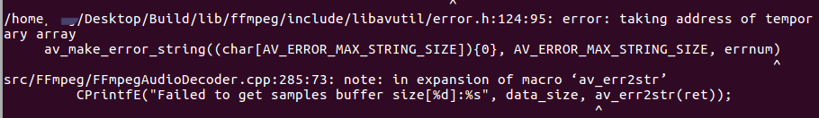

# Arm平台集成FFmpeg编译动态库库时av_make_error_string错误的解决方法

**编译环境**

- Linux: ubuntu 16.04 LTS
- arm-linux: 4.8.5
- FFmpeg: 3.4.2
- C++: std=c++11

**情况描述**

个人制作动态库需要集成FFmpeg，其中会使用到FFmpeg的转化错误提示接口av_err2str，其实它是如下宏定义：

```
#define av_err2str(errnum) \    
av_make_error_string((char[AV_ERROR_MAX_STRING_SIZE]){0}, AV_ERROR_MAX_STRING_SIZE, errnum)
```

因为上面这句宏定义中存在动态申请临时变量(char[AV_ERROR_MAX_STRING_SIZE]){0}，这种在我所编译的环境中是不被允许的，因此需要单独提取出来进行控制。
错误如下：



**解决思路**

单独将char[AV_ERROR_MAX_STRING_SIZE]){0}提出出来进行变量设置，如：

	char av_error[AV_ERROR_MAX_STRING_SIZE] = {0};

但是当多次调用的av_err2str时候将会出现av_error重复被定义的错误，因此可以将添加static关键字设置为静态变量。

libavutil/error.h:132改成如下

```
/**
 * Convenience macro, the return value should be used only directly in
 * function arguments but never stand-alone.
 */
//#define av_err2str(errnum) \
 //   av_make_error_string((char[AV_ERROR_MAX_STRING_SIZE]){0}, AV_ERROR_MAX_STRING_SIZE, errnum)

av_always_inline char* av_err2str(int errnum)
{
    static char str[AV_ERROR_MAX_STRING_SIZE];
    memset(str, 0, sizeof(str));
    return av_make_error_string(str, AV_ERROR_MAX_STRING_SIZE, errnum);
}
```

再次编译，完美解决。但是这种方案存在内存消耗问题，可能导致av_error的内存直至程序终止才释放。由于时间仓促，暂未找到其他更好的解决方案。待后续更新…

————————————————

版权声明：本文为CSDN博主「W2Y」的原创文章，遵循CC 4.0 BY-SA版权协议，转载请附上原文出处链接及本声明。

原文链接：https://blog.csdn.net/lizhijian21/article/details/102795395
