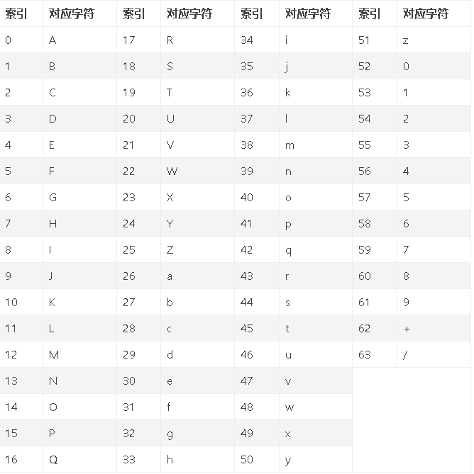
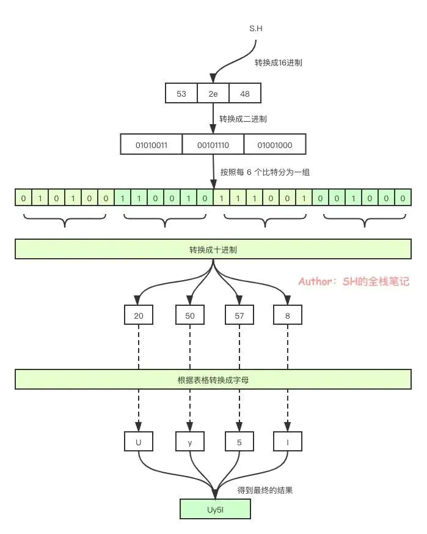
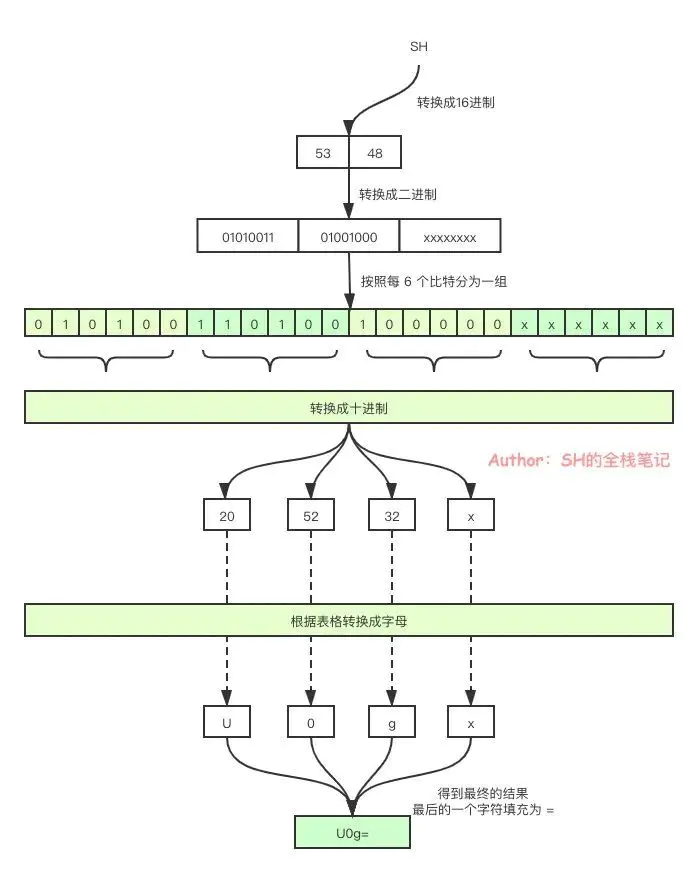
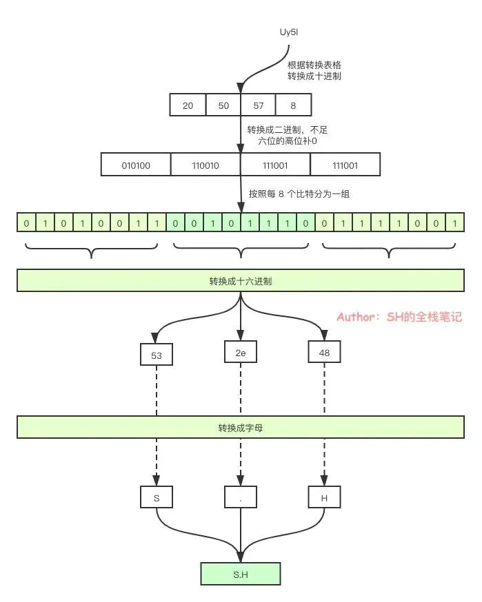
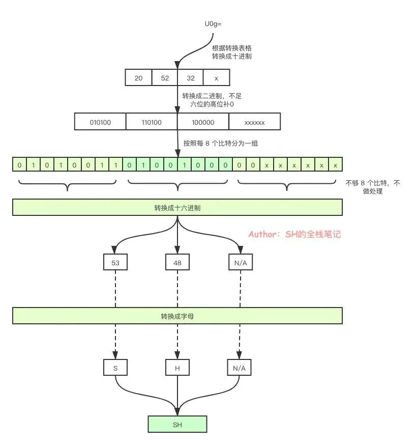

# C语言应用（3）——Base64编码解码 #

## 一、简介 ##

Base64是网络上最常见的用于传输8Bit字节码的编码方式之一，Base64就是一种基于64个可打印字符来表示二进制数据的方法。可查看RFC2045～RFC2049，上面有MIME的详细规范。

Base64编码是从二进制到字符的过程，可用于在HTTP环境下传递较长的标识信息。采用Base64编码具有不可读性，需要解码后才能阅读。

Base64由于以上优点被广泛应用于计算机的各个领域，然而由于输出内容中包括两个以上“符号类”字符（+, /, =)，不同的应用场景又分别研制了Base64的各种“变种”。为统一和规范化Base64的输出，Base62x被视为无符号化的改进版本。

## 二、原理 ##

这里的讨论的前提是使用 UTF-8 编码

将输入流中的字节按每3个8bit分为一组，然后每次取6个bit，将其转换成表格中对应的数据，如此3个字节可Base64编码为4个字符，字节数增加三分之一。一直重复到没有剩余的字符为止，当位数不够时补0来满足一个字符，且要实现编码后的位数为4的倍数，不足的用“=”代替。

Base64编码索引如下：



## 三、示例 ##

**3.1 编码**

**3.1.1 位数充足情况**

- 第一步：“S”、“.”、"H"转换为对应的ASCII码值分别为0x53、0x2e、0x48。
- 第二步：转换为对应的二进制值是01010011、00101110、01001000。由此组成一个24位的二进制字符串，这里不足8个bit的高位补0即可。
- 第三步：将24位每6个bit分为一组，共四组。分别为 010100、110010、111001、001000。
- 第四步：将其转换成十进制得到，20、50、57、8。
- 第五步：用上面的值在Base64编码表中进行查找，分别对应：U、y、5、I。因此“S.H”Base64编码之后就变为：Uy5I。



**3.1.2 位数不足情况**

只有两字符：

- 第一步：“S”、"H"转换为对应的ASCII码值分别为0x53、0x48。
- 第二步：转换为对应的二进制值是01010011、01001000。
- 第三步：将每6个bit分为一组，共三组。分别为 010100、110100、1000。可以看到最后一组的比特位不足 6 个，在这种情况下，会进行末尾（低位）补0的操作。补完之后就会变成010100、110100、100000。但是你会发现，这里总共也只有18个比特，不满足 3 个字节一组的原则。在这种情况下，前三组会按照常规的Base64进行编码，而缺失的一组则会使用 = 来进行填充。
- 第四步：将其转换成十进制得到，20、52、32。
- 第五步：用上面的值在Base64编码表中进行查找，分别对应：U、0、g，再加上最后填充的 =。因此“SH”Base64编码之后就变为：U0g=。



只有一字符：

- 第一步：“S”转换为对应的ASCII码值分别为0x53。
- 第二步：转换为对应的二进制值是01010011。
- 第三步：将每6个bit分为一组，共两组。分别为 010100、11。可以第二组明显不满 6 个比特，进行低位补0操作。补完之后就会变成010100、110000。但是你会发现，这里这里只有2组，不满四组，所以这里需要填充2个 =。
- 第四步：将其转换成十进制得到，20、48。
- 第五步：用上面的值在Base64编码表中进行查找，分别对应：U、w，再加上最后填充的2个 =。因此“S”Base64编码之后就变为：Uw==。

**3.2 解码**

因为最终的编码产物中，如果 6 个比特的分组不满 4 组，会有 = 作为填充物，所以一个 Base64 完后的产物总是能够被 4 整除。

所以，在解密中，我们每次需要处理 4 个字符，将这 4 个字符编码之后转换成十进制，再转换成二进制，不足 6 位的高位补0，然后将 6 个比特一组的二进制数按原顺序重新分成每 8 个比特一组，也就是一个字节一组。然后将其转换成十六进制，再转换成对应的字符。

**3.2.1 位数充足情况**

- 第一步：按照每次处理4个字符的原理，Uy5I 在编码索引表中的值分别为20，50，57，8。
- 第二步：将其转换成二进制，不足六位的高位补0，再将其分成每8个bit一组，分别为01010011、00101110、01111001。
- 第三步：将分组好的比特转换成十六进制，得到0x53、0x2e、0x48。
- 第四步：将十六进制转换成字母得到，“S”、“.”、“H”，也就是 “S.H”



**3.2.2 位数不足情况**

- 第一步：U0g= 在编码索引表中的值分别为20，50，32。
- 第二步：将其转换成二进制，不足六位的高位补0，分别为010100、110100、100000。
- 第三步：再将其分成每8个bit一组，分别为01010011、01001000。
- 第四步：将分组好的比特转换成十六进制，得到0x53、0x48。
- 第五步：将十六进制转换成字母得到，“S”、“H”，也就是 “SH”



**四、实现**

**4.1 base64.h**

```
#ifndef _BASE64_H_
#define _BASE64_H_

/*********************************************************************
 * INCLUDES
 */
#include <stdint.h>

/*********************************************************************
 * API FUNCTIONS
 */
uint8_t Base64_Encode(char *pInData, uint32_t inLen, char *pOutData, uint32_t *pOutLen);
uint8_t Base64_Decode(char *pInData, uint32_t inLen, char *pOutData, uint32_t *pOutLen);

#endif /* _BASE64_H_ */
```

**4.2 base64.c**

```
/*********************************************************************
 * INCLUDES
 */
#include <stdint.h>
#include <stddef.h>
#include "base64.h"

/*********************************************************************
 * LOCAL VARIABLES
 */
static char s_base64Table[] = 
{
    'A','B','C','D','E','F','G','H','I','J',
    'K','L','M','N','O','P','Q','R','S','T',
    'U','V','W','X','Y','Z','a','b','c','d',
    'e','f','g','h','i','j','k','l','m','n',
    'o','p','q','r','s','t','u','v','w','x',
    'y','z','0','1','2','3','4','5','6','7',
    '8','9','+', '/', '\0'
};

/*********************************************************************
 * PUBLIC FUNCTIONS
 */
/**
 @brief Base64编码
 @param pInData -[in] 源字符串
 @param inLen -[in] 源字符串长度
 @param pOutData -[out] 编码后字符串
  @param pOutLen -[out] 解码后字符串长度
 @return 1 - 成功；0 - 失败
*/
uint8_t Base64_Encode(char *pInData, uint32_t inLen, char *pOutData, uint32_t *pOutLen)
{
    if(NULL == pInData || 0 == inLen)
    {
        return 0;
    }

    uint32_t i = 0;
    uint32_t j = 0;
    uint32_t temp = 0;
    // 3字节一组进行转换
    for(i = 0; i < inLen; i += 3) 
    {
        // 获取第一个6位
        temp = (*(pInData + i) >> 2) & 0x3F;
        *(pOutData + j++) = s_base64Table[temp];

        // 获取第二个6位的前两位
        temp = (*(pInData + i) << 4) & 0x30;
        // 如果只有一个字符，那么需要做特殊处理
        if(inLen <= (i + 1)) 
        {
            *(pOutData + j++) = s_base64Table[temp];
            *(pOutData + j++) = '=';
            *(pOutData + j++) = '=';
            break;
        }
        // 获取第二个6位的后四位
        temp |= (*(pInData + i + 1) >> 4) & 0x0F;
        *(pOutData + j++) = s_base64Table[temp];

        // 获取第三个6位的前四位
        temp = (*(pInData+ i + 1) << 2) & 0x3C;
        if(inLen <= (i + 2))
        {
            *(pOutData + j++) = s_base64Table[temp];
            *(pOutData + j++) = '=';
            break;
        }
        // 获取第三个6位的后两位
        temp |= (*(pInData + i + 2) >> 6) & 0x03;
        *(pOutData + j++) = s_base64Table[temp];

        // 获取第四个6位
        temp = *(pInData + i + 2) & 0x3F;
        *(pOutData + j++) = s_base64Table[temp];
    }
    *(pOutData + j) = '\0';
    // 编码后的长度
    *pOutLen = inLen * 8 / 6;
    return 1;
}

/**
 @brief Base64解码
 @param pInData -[in] 源字符串
 @param inLen -[in] 源字符串长度
 @param pOutData -[out] 解码后字符串
 @param pOutLen -[out] 解码后字符串长度
 @return 1 - 成功；0 - 失败
*/
uint8_t Base64_Decode(char *pInData, uint32_t inLen, char *pOutData, uint32_t *pOutLen)
{
    if(NULL == pInData || 0 == inLen || inLen % 4 != 0)
    {
        return 0;
    }

    uint32_t i = 0;
    uint32_t j = 0;
    uint32_t k = 0;
    char temp[4] = "";
    // 4字节一组进行转换
    for(i = 0; i < inLen; i += 4)
    {
        // 找到在编码索引表中对应的值
        for(j = 0; j < 64; j++) 
        {
            if(*(pInData + i) == s_base64Table[j])
            {
                temp[0] = j;
            }
        }        
        for(j = 0; j < 64; j++)
        {
            if(*(pInData + i + 1) == s_base64Table[j])
            {
                temp[1] = j;
            }
        }
        for(j = 0; j < 64; j++)
        {
            if(*(pInData + i + 2) == s_base64Table[j])
            {
                temp[2] = j;
            }
        }
        for(j = 0; j < 64; j++) 
        {
            if(*(pInData + i + 3) == s_base64Table[j]) 
            {
                temp[3] = j;
            }
        }

        // 获取第一个6位和第二个6位的前两位组成一个8位
        *(pOutData + k++) = ((temp[0] << 2) & 0xFC) | ((temp[1] >> 4) & 0x03);
        if(*(pInData + i + 2) == '=')
        {
            break;
        }
        // 获取第二个6位的前四位和第三个6位的前四位组成一个8位
        *(pOutData + k++) = ((temp[1] << 4) & 0xF0) | ((temp[2] >> 2) & 0x0F);
        if(*(pInData + i + 3) == '=')
        {
            break;
        }
        // 获取第三个6位的后两位和第四个6位组成一个8位
        *(pOutData + k++) = ((temp[2] << 6) & 0xF0) | (temp[3] & 0x3F);
    }
    *pOutLen = k;
    return 1;
}

/****************************************************END OF FILE****************************************************/
```

## 五、用法 ##

**编码：**

编码前：a123456

编码后：YTEyMzQ1Ng==

```
#include <stdio.h>
#include <string.h>
#include "base64.h"

int main()
{
    char *test = "a123456";
    uint32_t bufLen;
    char *buf = (char *)malloc(sizeof(char) * 1024);
    memset(buf, 0, sizeof(char) * 1024);

    Base64_Encode(test, strlen(test), buf, &bufLen);

    for(int i = 0; i < bufLen; i++)
    {
        printf("%c", buf[i]);
    }
    
    free(buf);
    buf = NULL;
       
    return 0;
}
```

**解码：**

解码前：YTEyMzQ1Ng==

解码后：a123456

```
#include <stdio.h>
#include <string.h>
#include "base64.h"

int main()
{
    char *test = "YTEyMzQ1Ng==";
    uint32_t bufLen;
    char *buf = (char *)malloc(sizeof(char) * 1024);
    memset(buf, 0, sizeof(char) * 1024);

    Base64_Decode(test, strlen(test), buf, &bufLen);

    for(int i = 0; i < bufLen; i++)
    {
        printf("%c", buf[i]);
    }
    
    free(buf);
    buf = NULL;
       
    return 0;
}
```

• 由 Leung 写于 2022 年 10 月 12 日

• 参考：

[Base64 原理](https://links.jianshu.com/go?to=https%3A%2F%2Fcloud.tencent.com%2Fdeveloper%2Farticle%2F2074858%3Ffrom%3Darticle.detail.1885266)

[C语言base64实现](https://links.jianshu.com/go?to=https%3A%2F%2Fblog.csdn.net%2Fqq_63792137%2Farticle%2Fdetails%2F124461549%3Fops_request_misc%3D%25257B%252522request%25255Fid%252522%25253A%252522166536937516800186552824%252522%25252C%252522scm%252522%25253A%25252220140713.130102334..%252522%25257D%26request_id%3D166536937516800186552824%26biz_id%3D0%26utm_medium%3Ddistribute.pc_search_result.none-task-blog-2%7Eblog%7Esobaiduend%7Edefault-1-124461549-null-null.nonecase%26utm_term%3Dc%25E8%25AF%25AD%25E8%25A8%2580base64%26spm%3D1018.2226.3001.4450)

[base64编码原理及C语言实现](https://links.jianshu.com/go?to=https%3A%2F%2Fblog.csdn.net%2Fqq_45698138%2Farticle%2Fdetails%2F125101541%3Fops_request_misc%3D%26request_id%3D%26biz_id%3D102%26utm_term%3Dbase64%2520c%25E8%25AF%25AD%25E8%25A8%2580%26utm_medium%3Ddistribute.pc_search_result.none-task-blog-2%7Eblog%7Esobaiduweb%7Edefault-1-125101541.nonecase%26spm%3D1018.2226.3001.4450)

作者：Leung_ManWah

链接：https://www.jianshu.com/p/0fc20027134a

来源：简书

著作权归作者所有。商业转载请联系作者获得授权，非商业转载请注明出处。