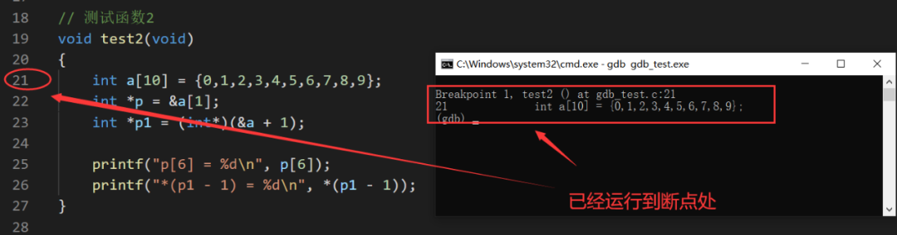
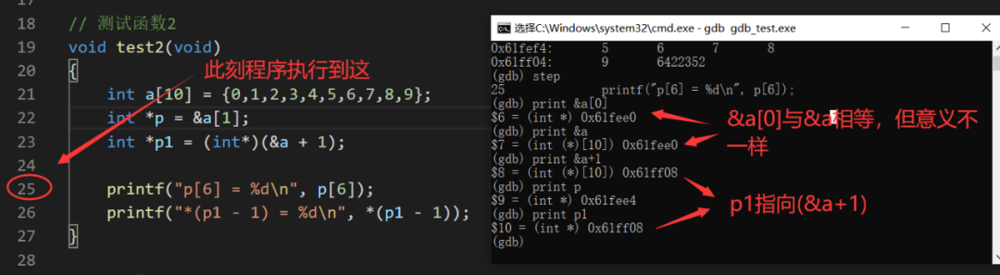

# GDB调试器原来那么简单 #


## GDB简介 ##

GDB（GNU Debugger）是一个强大的命令行调试工具。一般的，在Windows下进行开发，很少操控命令行调试，调试器大多与编译器都集成在IDE里了。

当然，在Windows下也可以直接使用gcc、gdb来做编译调试我们的C程序，如MinGW（ 一个可自由使用和自由发布的Windows特定头文件和使用GNU工具集导入库的集合 ）中就同时包含有gcc与gdb工具：


使用gdb -v命令可查看gdb的版本：


但是，在Linux下进行开发，gdb工具是必知必会的工具之一。

小编最近也转战Linux了，自然也要掌握一些必知必会的基础工具及知识。小编也是用到哪学到哪，本篇笔记我们先来分享gdb的使用：

## 实例演示GDB的使用 ##

老读者们都知道，本公众号文章的特点之一就是实例比较多、可操作性比较强，跟着文章一步一步做应该可以学到一些东西。

同样的，本篇笔记我们也以实例来做分析。

示例代码gdb_test.c：

左右滑动查看全部代码>>>

```
// 公众号：嵌入式大杂烩
// 作者：ZhengN
#include <stdio.h>
 
// 测试函数1
void test0(void)
{
 int i = -1;
 
 if (i = 0)
  printf("i = %d\n", i);
 else if (i = 1)
  printf("i = %d\n", i);
 else
  printf("i = %d\n", i);
}
 
// 测试函数2
void test1(void)
{
 int a[10] = {0,1,2,3,4,5,6,7,8,9};
 int *p = &a[1];
 int *p1 = (int*)(&a + 1);
 
 printf("p[6] = %d\n", p[6]);  
 printf("*(p1 - 1) = %d\n", *(p1 - 1));  
}
 
// 主函数
int main(int argc, char *argv[])
{
    test0();
    test1();
    
    return 0;
}
```

这个示例代码中有两个测试函数，其实也是两道经典易错的面试笔试题。大家可以先思考一下结果是什么。

下面我们使用gdb来一步一步调试及分析，在Windows下做实验，Linux下的操作类似。

一般的，我们使用如下命令来编译：

	gcc gdb_test.c -o gdb_test.exe

这样编译出来的gdb_test.exe是不带调试信息的。我们必须编译出带有调试信息（如行号等信息）的可执行文件才能使用gdb进行调试。在以上基础上加个-g参数即可生成调试信息。

除此之外，我们编译时应不使用优化选项，若使用优化，则编译器会对程序进行一些优化，有可能会更改语句的顺序及优化一些变量，从而可能会导致程序执行流程与源码流程不匹配的情况。

进一步，可以使用-Wall参数打开所有警告，所以我们的编译命令变为：

	gcc -g -Wall gdb_test.c -o gdb_test.exe

**1、GDB常用命令**

下面粗略地列出一些常用的命令：


**2、demo调试分析**

使用上面的编译命令编译得到带调试信息的可执行程序gdb_test.exe，有两种方法启动调试。

一种方法是先输入gdb命令进入gdb环境，再输入file+可执行程序装入调试文件，即：


另一种方法是直接输入gdb+可执行程序对该程序进行调试，即：


**（1）调试测试函数1**

上面的测试函数1大家思考得出结果了吗？我们单步调试看看结果是怎么样的：

① 在test1函数入口打个断点：


② 运行到断点处：


③ 单步往下执行：


显然，单步运行到了这一句我们就得出了测试函数1的结果，即输出 i = 1。大家分析得对了吗？

这要是不注意还真的容易出错，这里的if判断条件里用的是=号，而不是==号，这个小陷阱可能会迷惑一些初学C语言的朋友。

if语句的通用形式为：

```
if (expression)
 statement
```

可以明确的是：如果对expression为真（非0），则执行statement。本题中，如if (i = 0)其实就等价于

```
i = 0;
if (i)
```

显然这里的if语句的expression为假，不会执行statement。

类似的if (i = 1)等价于

```
i = 1;
if (i)
```

显然这里的if语句的expression为真，执行statement。

平时在发现自己写的代码执行的流程异常时，不妨debug调试一下，一步一步地走，看程序是否按照自己设计的流程走，看是不是我们的执行逻辑设计错了。

**（2）调试测试函数2**

测试函数2也是一道极其经典的面试题目。不能一眼看出结果？没关系，我们一起调试分析一下。接着上面的流程，我们输出quit命令推出gdb环境，再重新进入调试test2。

① 在test2函数入口打个断点：


② 运行到断点处：



此时，我们不妨看一下a[1]元素的地址及a数组里面的内容是什么：


可见，在数组初始化之前，整个数组空间里的值是一些随机值。这里反映一个问题，局部变量在初始化之前的值是无规律的，所以不妨在定义局部变量的时候初始化一个确定的值，防止出错。

**③ 单步往下执行：**

此时，我们来看一下，指针变量p的值、a数组里的值：


因为此时第23行这条语句还未执行，所以p指向的地址还不是a[1]元素的地址。

再单步往下执行，然后我们看一下，指针变量p的值，及以指针变量p的值为首地址、往后偏移10个内存单元为结束地址，这一段空间内的值是什么：


至此，我们通过调试清晰地得到了p[6]的值。

继续单步往下执行，我们看一下，&a[0]的值、&a的值、(&a+1)的值、p1的值：



从gdb输出的信息我们知道&a的类型是(int (*) [10] )，即是一个指向含有10个元素的整形数组的指针，所以(&a+1)的意义是往后偏移10 * sizeof(int)。进一步，再利用一下其它输出的信息：

    &a的值为0x61fee0
    &a+1的值为0x61ff08


两个值相减得到40，正好是整个数组所占的字节数。

而p1是一个整形指针，所以p1-1指向的就是往前偏移sizeof(int)个字节的地址，即a[9]的地址（0x61ff04），所以*(p1 - 1)的值也就是a[9]的值。最后我们再看一下&a往后的40个地址里的值都是些什么：


以上就是本次的实例演示，只是用到了一小部分gdb的命令，还有更多命令大家可以自己练习使用，基本的会了，不懂的地方遇到的时候再查也来得及。

可能写得有些乱，但也希望能对大家有帮助。总之，对于一些不确定的知识点或者程序的执行与预期不相符时，不妨调试一下，一步一步看数据有没有异常。

原文链接： https://blog.csdn.net/FILLMOREad/article/details/109089004