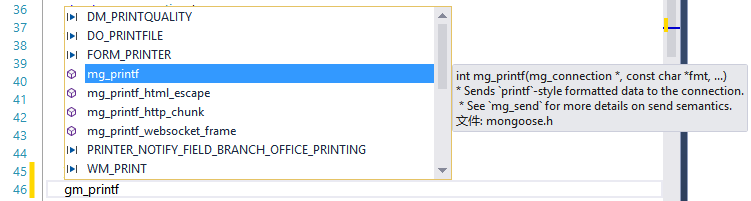

# Mongoose 利用实现HTTP服务

**注意：这里是使用mongoose实现HTTP服务，非数据库使用。**

最近由于需要使用HTTP服务端，原先是使用的Qt框架实现的HTTP服务端，然后发现有些缺陷导致我不得不放弃这个框架，也不是完全放弃，只是HTTP服务端这里不再使用Qt，用Qt做高并发真的有点不好。

然后毅然的选择了mongoose这个框架，主要是听说这玩意 嵌入到代码中非常方便。下载之后发现果然就一个 h文件和cpp文件。。

 

于是开始研究这个框架，根据mongoose 用户手册再加上一堆实例教程，基本上写了一个类 进行操作封装（并不是完全的封装了）

 

MoHttp.h文件
主要是实现mongoose框架的基本 变量获取。注意里面有重载，主要是为了方便使用。

```
#define _MOHTTP_H
#ifdef _MOHTTP_H


#include "mongoose.h"
#include <iostream>

using namespace std;

const int CHAR_HTTP_VAR_MAX = 128;
const int CHAR_HTTP_COOKIE_MAX = 400;


class MoHttp
{
private:
    struct http_message *hm = NULL;

public:
    MoHttp(struct http_message *);
    ~MoHttp();
        int getGetVar(const char*, char*) const;    //获取变量
        void getGetVar(const char*, string &) const;    //获取变量
        int getPostVar(const char*, char*) const;    //获取变量
        void getPostVar(const char*, string &) const;    //获取变量
        int getCookie(const char*, char*) const;    //获取Cookie
        void getCookie(const char*, string &) const;    //获取Cookie
     int Model() const;    //判断当前模式 POST/GET    1为 GET 否则为0
};

#endif
```

MoHttp.cpp
实现各类方法。

```
#include "MoHttp.h"


MoHttp::MoHttp(struct http_message * hm = NULL)
{
    this->hm = hm;
}

int MoHttp::getGetVar(const char* name, char* var) const
{
    memset(var, '\0', sizeof(var));
    if (hm == NULL || name == NULL || hm->query_string.p == NULL)return -1; 
    return mg_get_http_var(&hm->query_string, name, var, sizeof(var));        //获取变量
}

void MoHttp::getGetVar(const char* name, string & str) const
{
    str = "";
    char var[CHAR_HTTP_VAR_MAX];
    var[0] = '\0';
    if (hm == NULL || name == NULL || hm->query_string.p == NULL)return;
    mg_get_http_var(&hm->query_string, name, var, sizeof(var));        //获取变量
    if (var[0] == '\0'){
        return;
    }
    str = var;    //如果数据正确
}

int MoHttp::getPostVar(const char* name, char* var) const
{
    memset(var,'\0',sizeof(var));
    if (hm == NULL || name == NULL || hm->body.p == NULL)return -1; 
    return mg_get_http_var(&hm->body, name, var, sizeof(var));        //获取变量
}

void MoHttp::getPostVar(const char* name, string & str) const
{
    str = "";
    char var[CHAR_HTTP_VAR_MAX];
    var[0] = '\0';
    if (hm == NULL || name == NULL || hm->query_string.p == NULL)return;
    mg_get_http_var(&hm->body, name, var, sizeof(var));        //获取变量
    if (var[0] == '\0'){
        return;
    }
    str = var;    //如果数据正确
}


int MoHttp::Model() const
{

    if (hm == NULL || hm->method.p == NULL)return -1;    //数据错误
    if (mg_vcmp(&hm->method, "POST") != 0)return 1;
    return 0;
    
}
int MoHttp::getCookie(const char * name, char * var) const
{
    memset(var, '\0', sizeof(var));
    //mg_printf(nc, "Set-Cookie: %s=%s; path=/\r\n", "wwe", "123456789");    发送Cookie
    if (hm == NULL) return -999;
    struct mg_str *cookie_header = mg_get_http_header(hm, "cookie");    //获取Cookie 整条
    if (cookie_header == NULL) return -999; //<0
    return mg_http_parse_header(cookie_header, name, var, sizeof(var));
}

void MoHttp::getCookie(const char* name, string & str) const
{
    str = "";
    char var[CHAR_HTTP_COOKIE_MAX];    //Cookie 最大更长
    var[0] = '\0';
    if (hm == NULL || name == NULL || hm->query_string.p == NULL)return;
    struct mg_str *cookie_header = mg_get_http_header(hm, "cookie");    //获取Cookie 整条
    if (cookie_header == NULL) return;
    mg_http_parse_header(cookie_header, name, var, sizeof(var));
    if (var[0] == '\0'){
        return;
    }
    str = var;    //如果数据正确
}

MoHttp::~MoHttp()
{

}
```

使用方法：

Mo.cpp（或Main.cpp）

```
// Copyright (c) 2016 by Suwings
// All rights reserved


#include <iostream>
#include "MoHttp.h"

using namespace std;

static char *s_http_port = "23333";
static struct mg_serve_http_opts s_http_server_opts;

MoHttp * mo = NULL;


static void ev_handler(struct mg_connection *nc, int ev, void *p) {
    if (ev == MG_EV_HTTP_REQUEST) {                                        //如果是HTTP 请求
        struct http_message *hm = (struct http_message *) p;        //传为
        mo = new MoHttp(hm);                                                    //记得释放内存，实例化 MoHttp
        if (mo->Model()==1){
            //GET
        string w;　　　　　　　　　　　　　　　　　　　　　　　　　　　　//测试代码　　　　
        mo->getGetVar("user",w);　　　　　　　　　　　　　　　　　　　//测试代码
        if (w != "")cout << "变量:" << w.c_str() << endl;　　　　　//测试代码

        }else{　　　　　　　　　　　　　　　　　　　　　　　　　　　　　　//测试代码
            //POST
        }　　　　　　　　　　　　　　　　　　　　　　　　　　　　　　　　 //测试代码
        delete mo;            //释放变量
        mg_serve_http(nc, hm, s_http_server_opts);                        //数据发送
    }
}

int main(void) {
    struct mg_mgr mgr;
    struct mg_connection *nc;
    //struct mg_request_info *ww;
    mg_mgr_init(&mgr, NULL);
    printf("[状态] 服务器已经开启在端口:  %s\n", s_http_port);
    
    nc = mg_bind(&mgr, s_http_port, ev_handler);
    if (nc == NULL) {
        printf("Failed to create listener\n");
        return 1;
    }

    // Set up HTTP server parameters
    mg_set_protocol_http_websocket(nc);
    s_http_server_opts.document_root = "./www/";  // Serve current directory
    s_http_server_opts.enable_directory_listing = "no";    //Set if show dir
    for (;;) {
        mg_mgr_poll(&mgr, 1000);
    }
    mg_mgr_free(&mgr);

    return 0;
}
```


看了几个小时之后，差不多只能写出这么点东西了。然后我就一直在想。

但是你有没有发现，如果浏览器要是发送 Ajax 数据过来，假定逻辑在 C++ 代码里面，我应该如何设置返回的数据啊？

的确，这个类也没有加入 返回的数据，这个问题我也一直在困扰。

难道mongoose 框架都没有函数是可以设置数据在 body 的？百思不得其解的我于是去找了一下 mongoose 文档里面的例子，发现了一个Cookie验证的例子，原本我以为不管怎么样也会有设置数据的地方了，但是我惊奇的发现，是这样的：

 

Cookie_auth.c 例子文件

```
static void set_session_cookie(struct mg_connection *nc,　　　　
                               const struct session *s) {
  mg_printf(nc, "Set-Cookie: %s=%" INT64_X_FMT "; path=/\r\n",
            SESSION_COOKIE_NAME, s->id);
}

/*
 * If requested via GET, serves the login page.
 * If requested via POST (form submission), checks password and logs user in.
 */
static void login_handler(struct mg_connection *nc, int ev, void *p) {　　　　//主要看这个函数
  struct http_message *hm = (struct http_message *) p;
  if (mg_vcmp(&hm->method, "POST") != 0) {
    /* Serve login.html */
    mg_serve_http(nc, (struct http_message *) p, s_http_server_opts);
  } else {
    /* Perform password check. */
    char user[50], pass[50];
    int ul = mg_get_http_var(&hm->body, "user", user, sizeof(user));  
    int pl = mg_get_http_var(&hm->body, "pass", pass, sizeof(pass));
    if (ul > 0 && pl > 0) {   //如果有数据
      if (check_pass(user, pass)) {  //验证账号和密码 函数无须理会
        struct session *s = create_session(user, hm);   //mg_printf 是直接输出数据，并不是输出到body
        mg_printf(nc, "HTTP/1.0 302 Found\r\n");
        set_session_cookie(nc, s);                  //他是进行了一次跳转，并且直接返回的HTTP头
        mg_printf(nc, "Location: /\r\n"); 
        mg_printf(nc, "\r\nHello, %s!\r\n", s->user);
        //这句是控制台输出
        fprintf(stderr, "%s logged in, sid %" INT64_X_FMT "\n", s->user, s->id);  
      } else {
        mg_printf(nc, "HTTP/1.0 403 Unauthorized\r\n\r\nWrong password.\r\n");
      }
    } else {
      mg_printf(nc, "HTTP/1.0 400 Bad Request\r\n\r\nuser, pass required.\r\n");
    }
    nc->flags |= MG_F_SEND_AND_CLOSE;
  }
  (void) ev;
}
```

看完了之后我就跟纳闷了，为什么要直接输出HTTP头？框架难道真的没有提供类似的方法吗？

然后尝试了各类函数：

也无果，这些函数会 输出到 HTTP 响应头之前。



 

所以，是不是这个框架真的没有 什么设置返回的body 的函数呢？

 

总之目前只学到这里，也许有什么地方确实没有了解。暂且先记录下来，等知道了之后再续写。

本博客文章转载需要申请。如果你喜欢本博文，请留言支持，谢谢~