# Source Insight 3.5创建工程简介 #

1. 增加文件类型

因为SI软件有个特点，它只能发现自己识别了的文件类型，对于它未识别的文件视而不见。例如刚开始.s文件就不认识，要在C源文件中加入*s文件，欺骗SI软件*.s也是C的源文件。

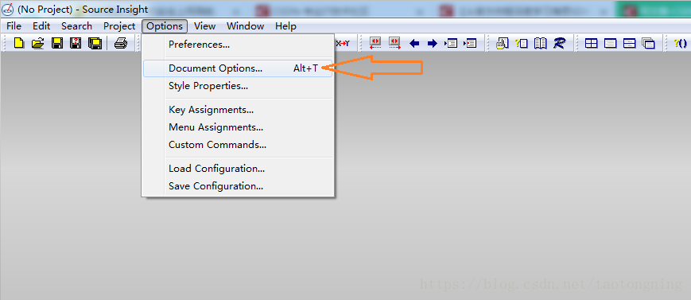

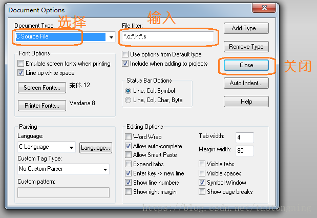

2. 在要查看的代码同级目录下新建文件夹，用来存放工程目录

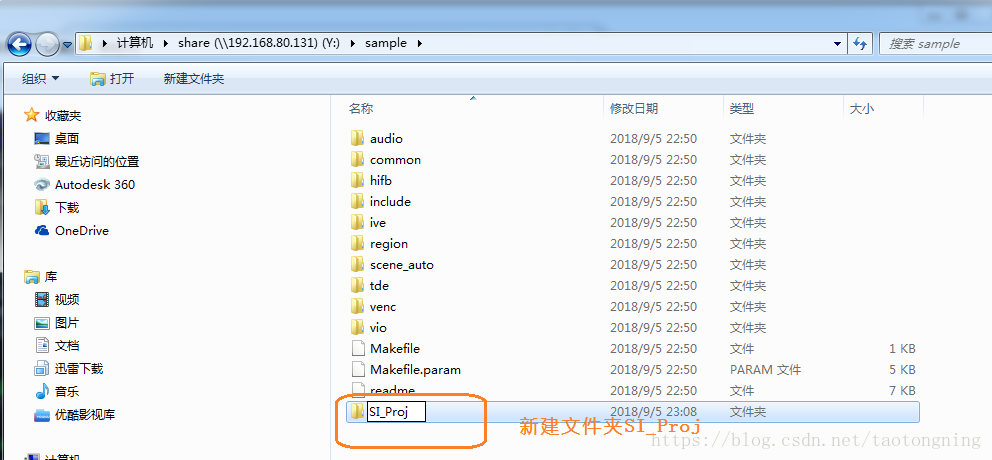

 

3. 创建新的工程

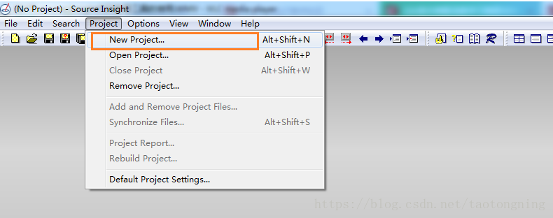

4. 新建项目的命名和指定存储路径

工程项目文件和工程中管理的源代码文件目录可以不同，建议放在源代码目录下，新建一个文件夹。

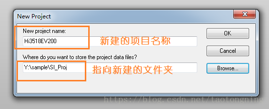

5. 默认OK

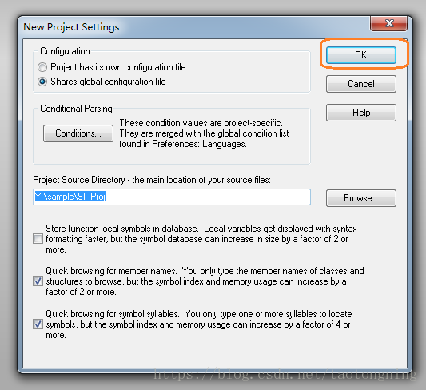

6. 向该项目添加文件，选择要添加的代码文件

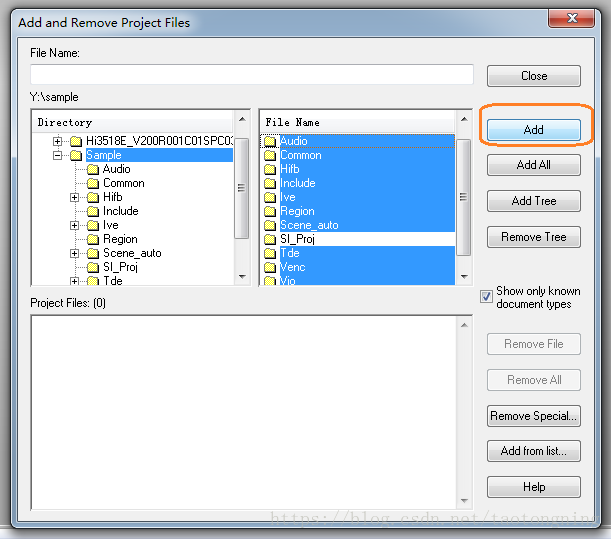

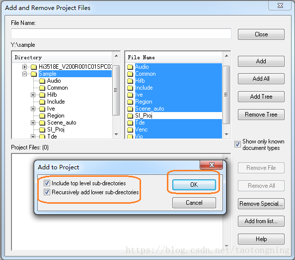

然后关闭对话框即可查看代码

7. 编译项目

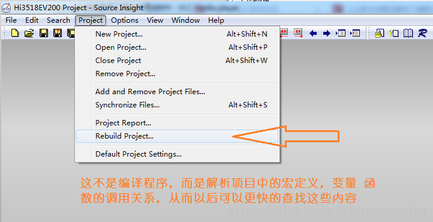

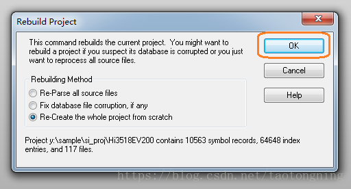

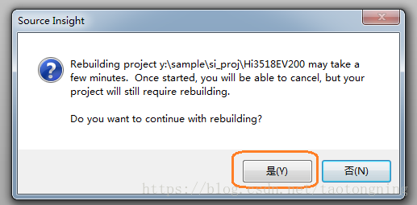

8. 重新打开项目

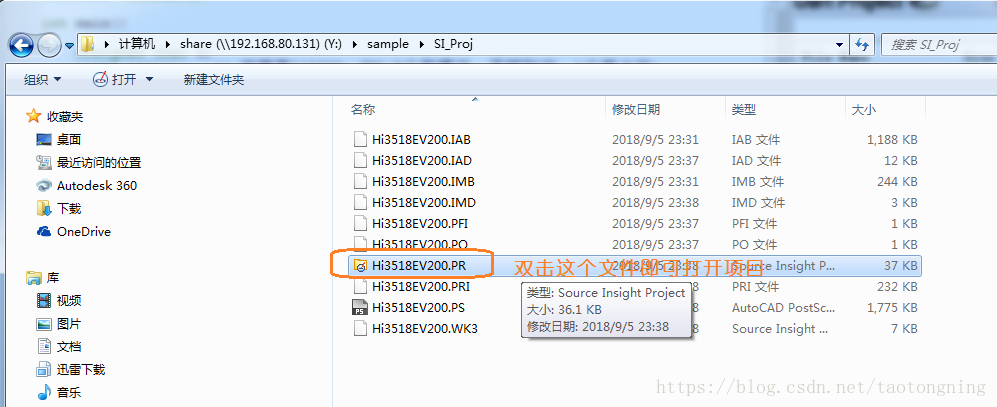

9. 项目中重新添加或删除文件

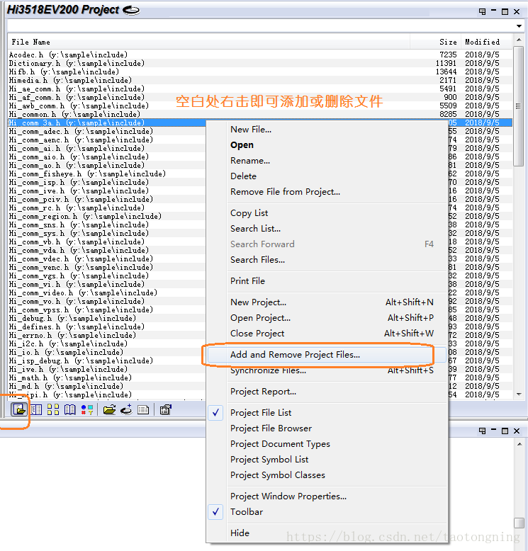

9. 字体的设置（解决中文乱码）

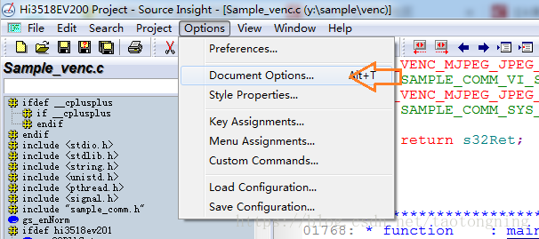

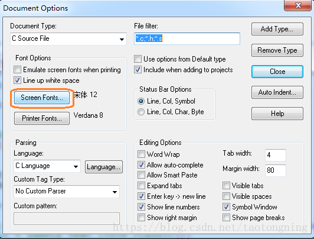

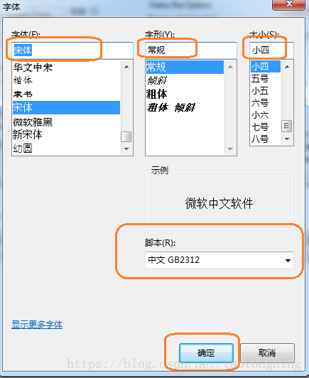

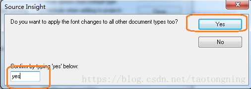

用Alt+F12来调整字体的等宽

10.窗口说明

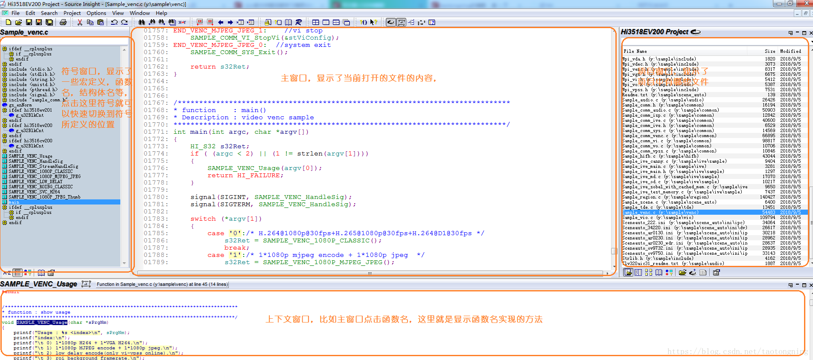

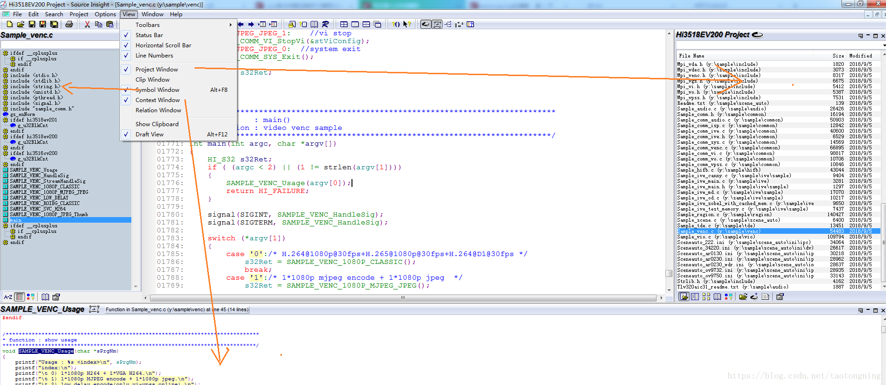

11.显示行号

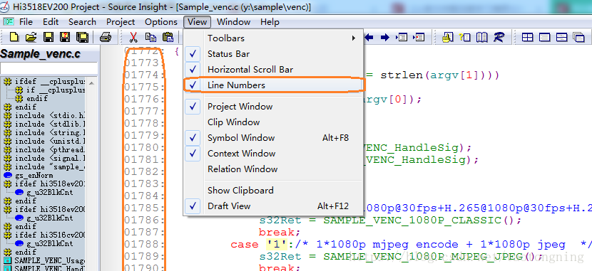

12. 快速切换到第几行

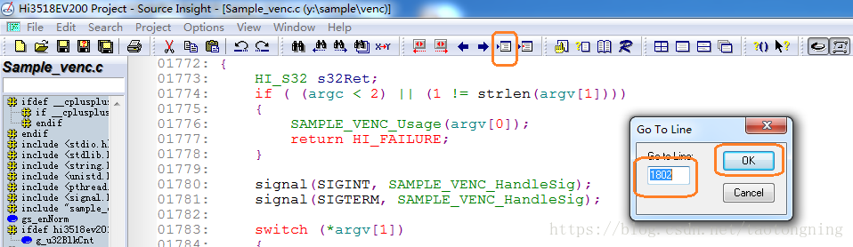

13.高亮关键词

鼠标放在要高亮的关键词上右击，在选一次Hilight words取消高亮

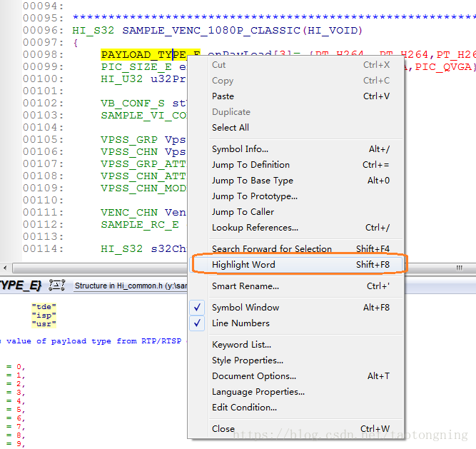

14 函数等定义跳转

跳转到定义用右击选Jump to defined或者ctr+鼠标左单击

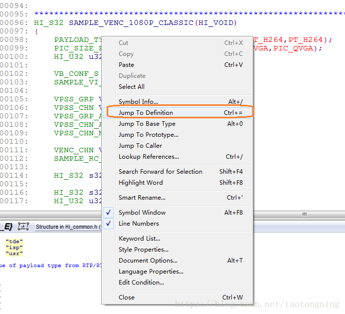

跳回来点击向左箭头

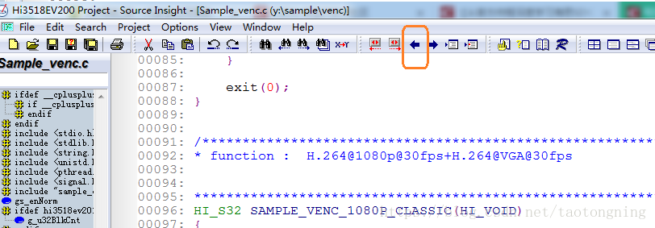

15. 查找

光标放在要查找的内容上右击，选择lookup

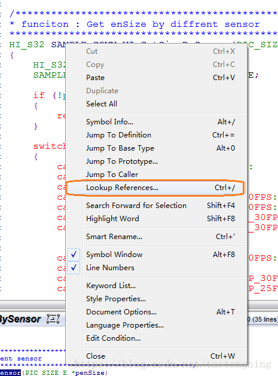

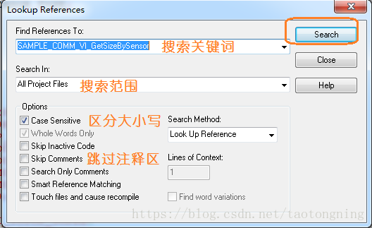

————————————————

版权声明：本文为CSDN博主「陶通宁」的原创文章，遵循CC 4.0 BY-SA版权协议，转载请附上原文出处链接及本声明。

原文链接：https://blog.csdn.net/taotongning/article/details/82432555