# Source Insight 4.0使用教程 #

创建工程,添加源程序

1.打开Source Insight4.0，工具栏选择Project -> New Project,将弹出下列框图:

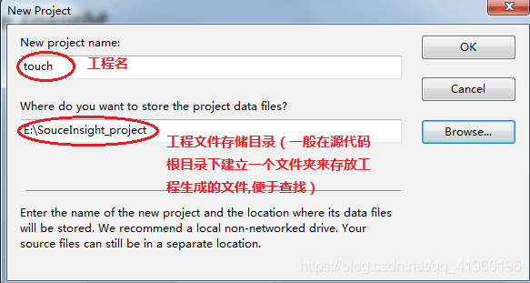

2.点击OK后,会弹出下列框图,填入工程的名称，以及工程文件生成的目录

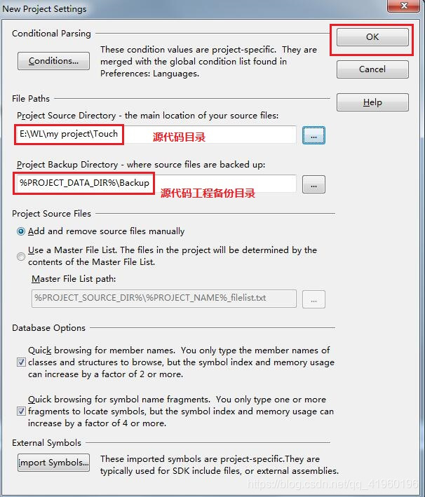

3.点击OK后,如下图:

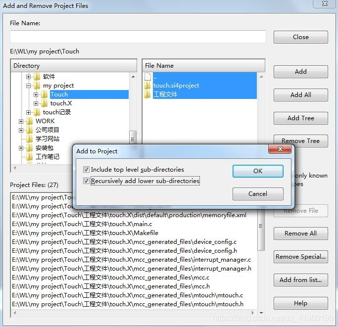

其中:                          

Add ：基本的文件添加操作

Add All ：添加整个工程所有的源文件（然后再选择是否递归添加子目录中的源文件,见上图对话框）

Add Tree ：添加指定的文件夹以及其子目录下的源代码文件

Remove Tree ：和Add Tree的功能相反

File Name可以不用写,完成点击close.

4.如没有出现下图,红色区域的栏目,按Ctrl + O即可

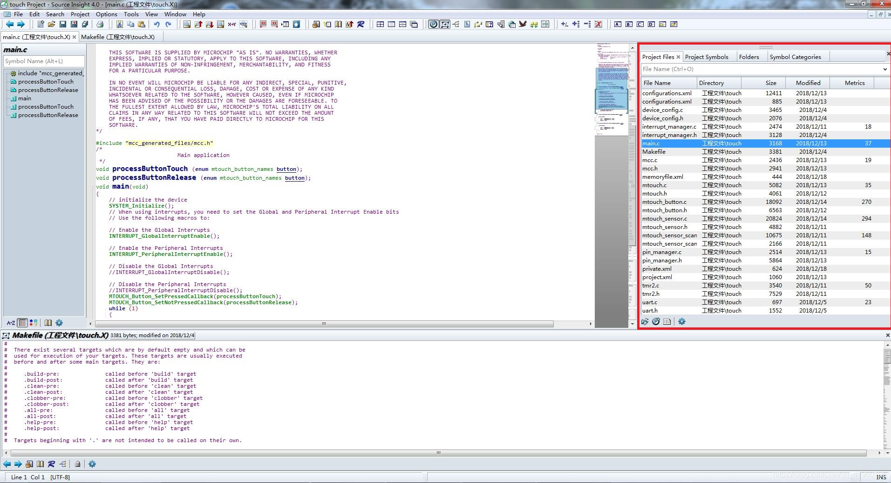

5.将添加的代码进行同步，生成阅读代码的索引和辅助文件，方便对源代码进行阅读;点击Project--> synchronization file,会弹出下图框图:

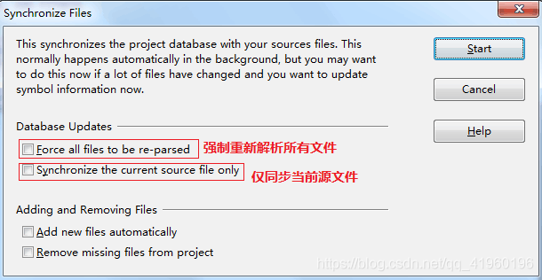

6.选择语言和后缀名的文件,点击Options-->File type Options,弹出下图框图：

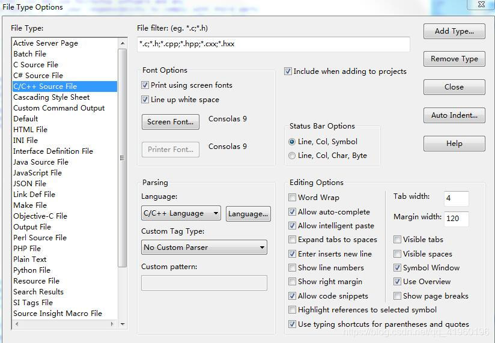

## 使用技巧 ##

1、选中字符，相同字符高亮

点击Options-->File type Options,弹出下图框图，标注项选上：

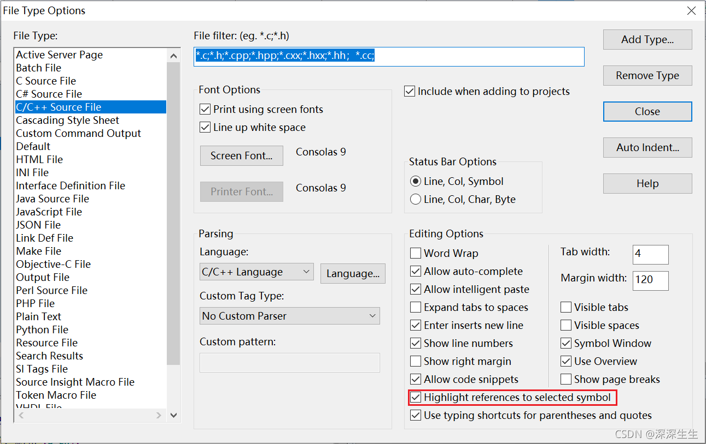

效果如下：

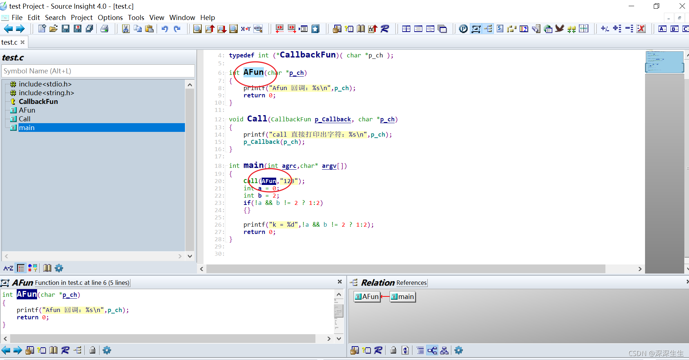

2、显示调用关系

方法1：

当选择某个函数时，显示函数调用流程，选择某个函数 -> 右键 -> Show in Relation Window，如下图所示。

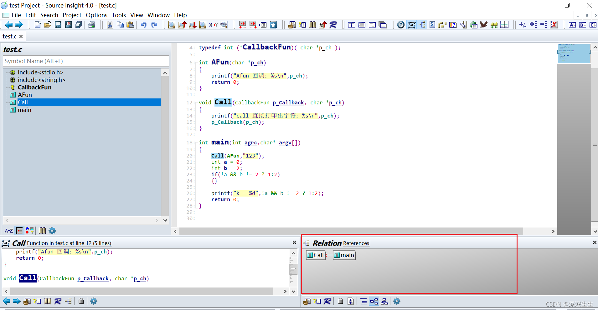

方法2：

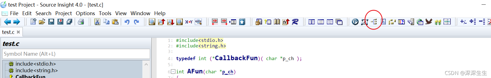

3、context window

context window 在看程序时很有用，当用户指向某个函数或变量时，在context window中都会有该变量或函数的定义。

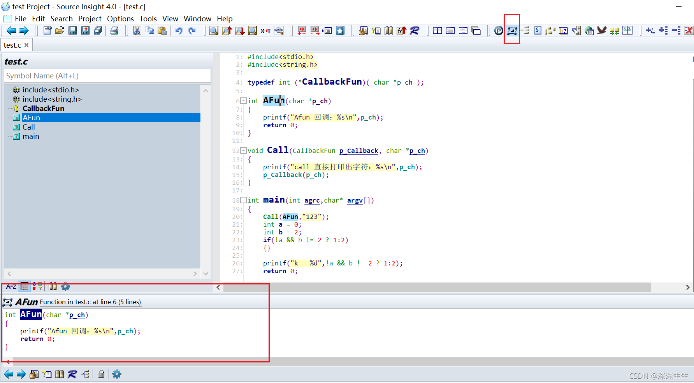

4、全局收索

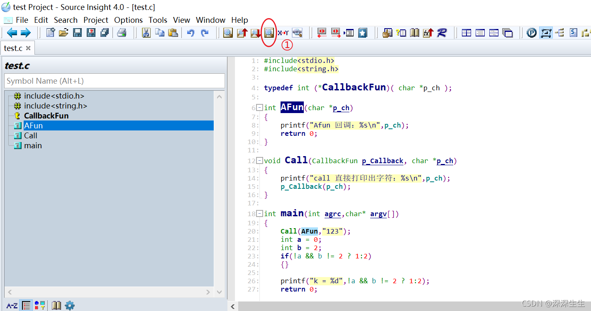

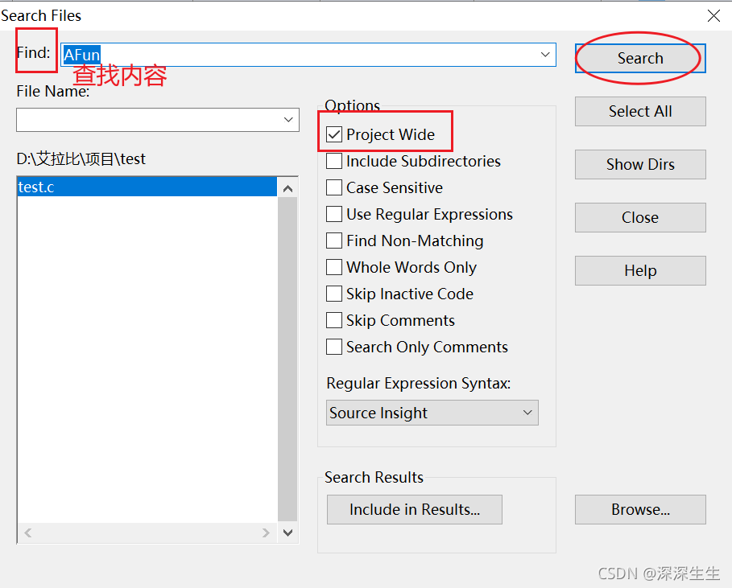

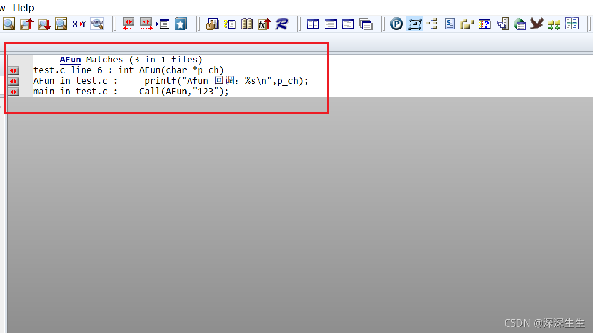

5、解决中文乱码

（1）单个文件

步骤：File -> Reload Enconding....

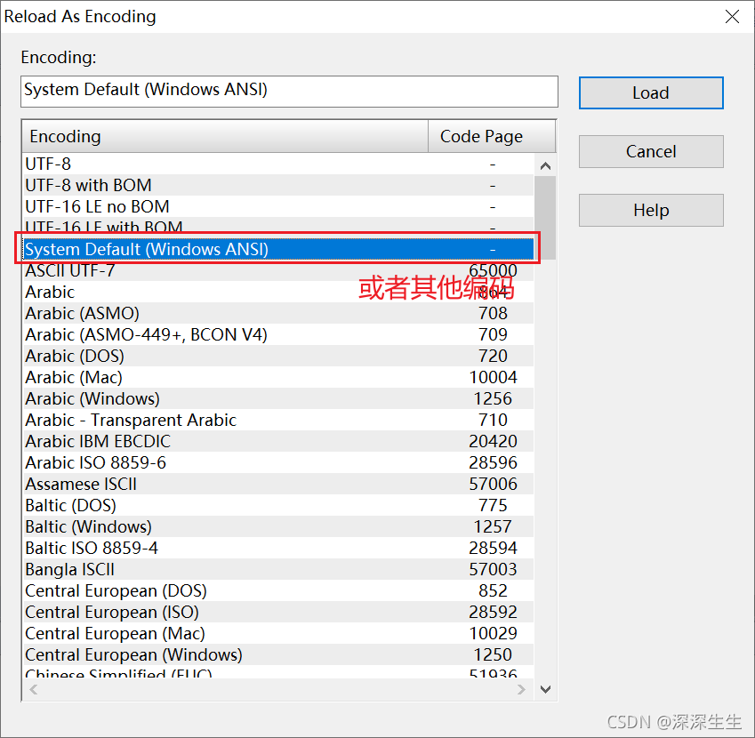

（2）所有文件

步骤：Options > Preferences >File标签。

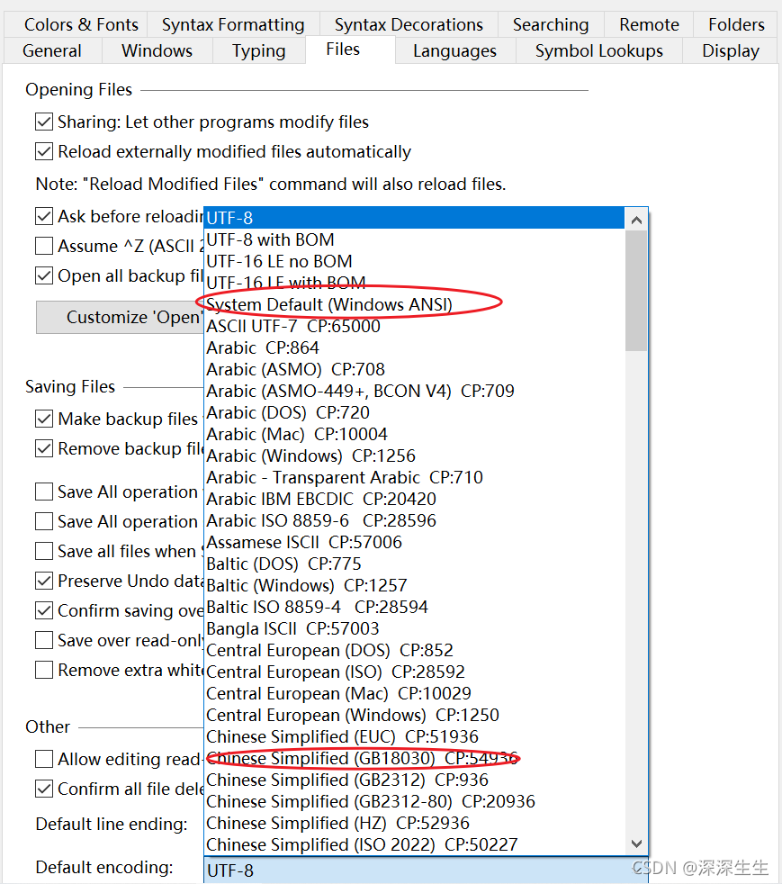

 
————————————————

版权声明：本文为CSDN博主「深深生生」的原创文章，遵循CC 4.0 BY-SA版权协议，转载请附上原文出处链接及本声明。

原文链接：https://blog.csdn.net/qq_41960196/article/details/86636713