一.创建项目dll文件
1.打开CLion软件

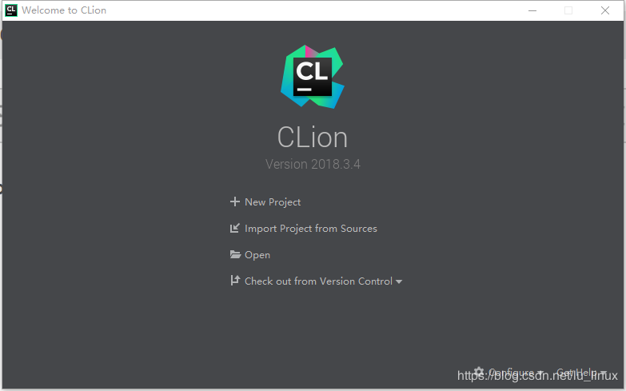

2.创建新项目，选择C Library，库类型有两种，动态库选择shared,静态库的话选择static, 点击创建

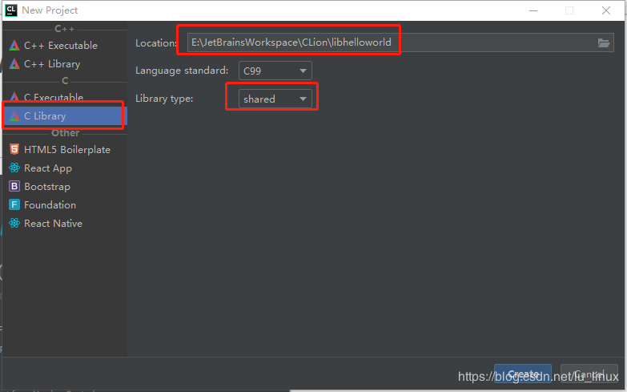

3.创建之后默认会自动生成文件如下：

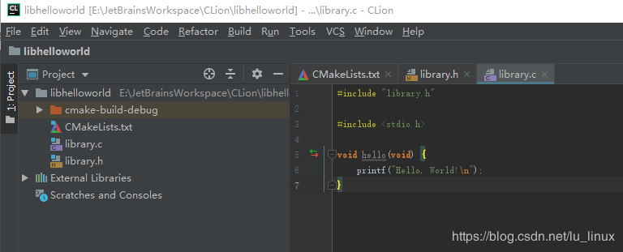

4.点击菜单上的“Build->Build Project”,可以看到生成了liblibhelloworld.dll

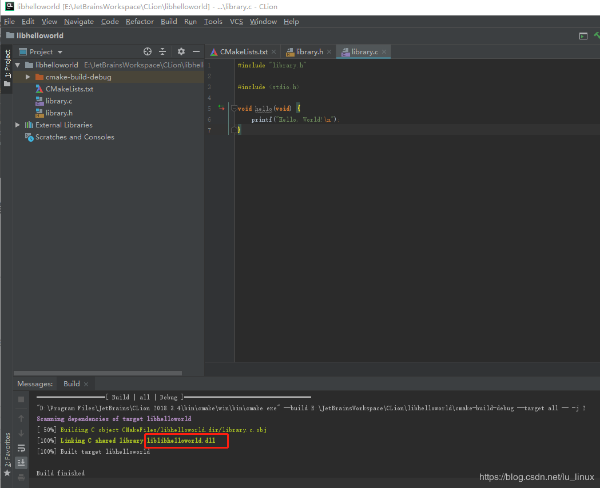

生成的库名字默认是“lib”+“项目名”，如果想改可以直接在CMakeList.txt里修改生成库名称。

二.创建项目demo
1.点击File->New Project,创建一个Demo

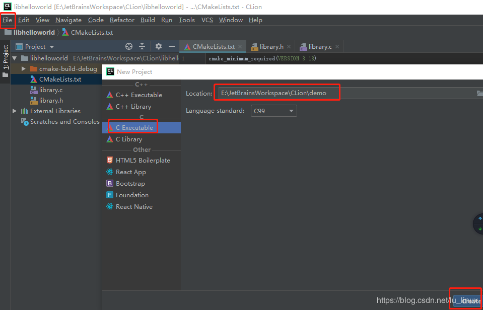

如果提示如下，选择新的窗口

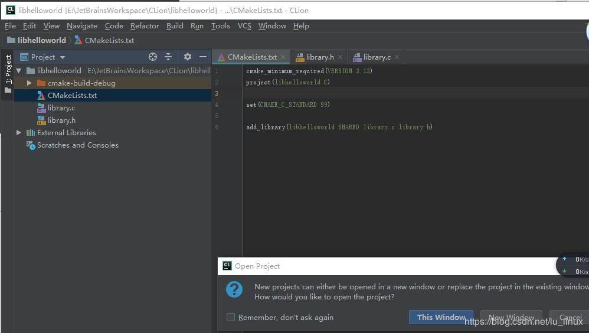

2.创建之后自动生成如下文件

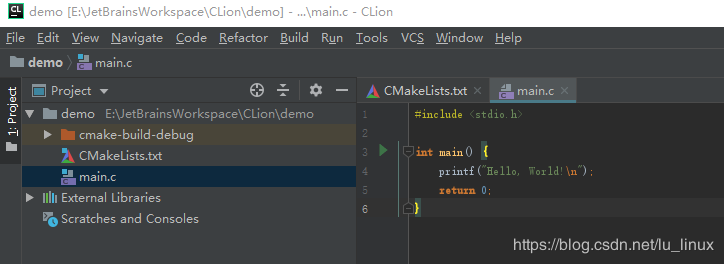

3.在demo项目下创建lib目录，将生成的liblibhelloworld.dll复制到lib.

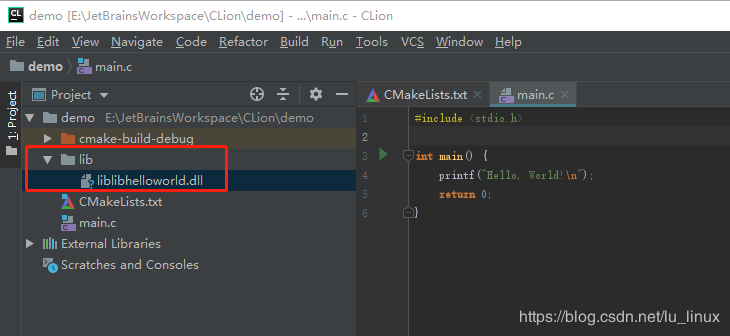

4.进入到CMakeList.txt文件进行修改

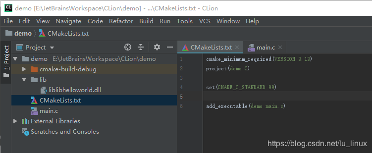

5.修改之后如下图，这样编译的时候就会找到lib下的liblibhelloworld.dll文件。

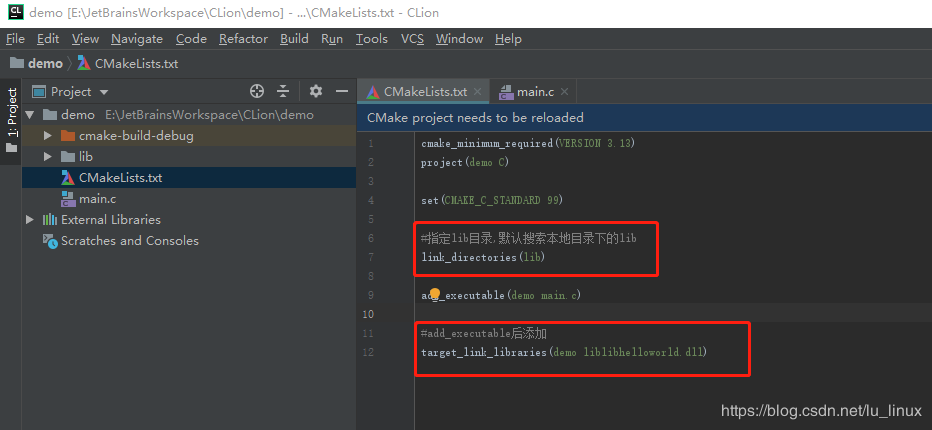

6.进入到main.c修改代码如下，点击运行会报如下错误，这是因为demo运行时找不到动态库。

如果是静态库，则不会报这个错误，因为静态库编译的时候会编译到应用程序（demo.exe）里。

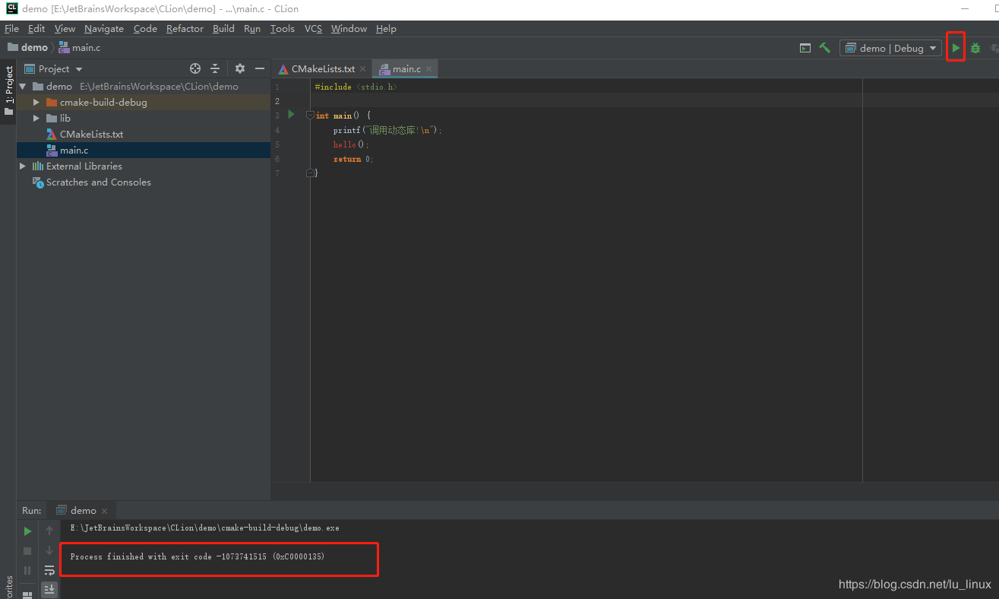

7.添加环境变量如下

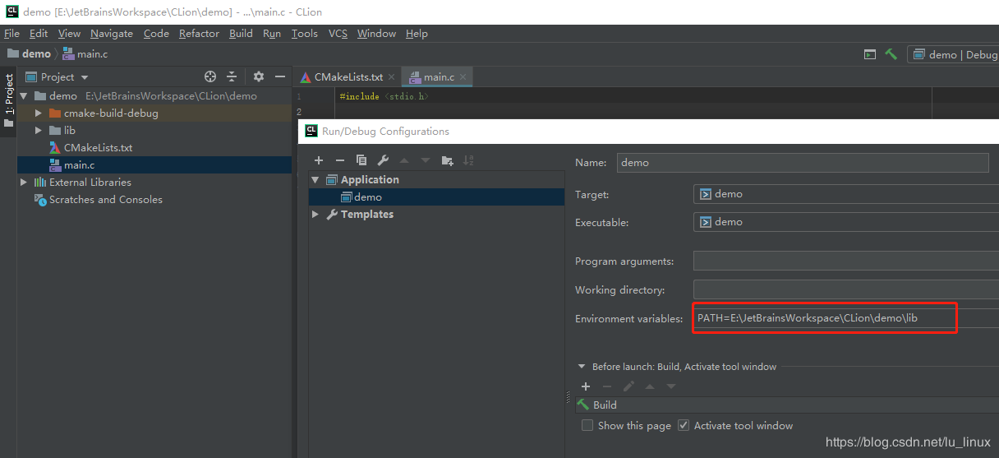

8.运行结果如下：

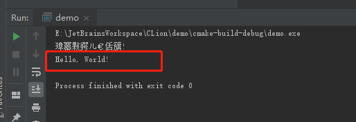

---

版权声明：本文为CSDN博主「我是谁？？」的原创文章，遵循CC 4.0 BY-SA版权协议，转载请附上原文出处链接及本声明。

原文链接：https://blog.csdn.net/lu_linux/article/details/89357655