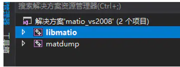

# libmatio开发笔记（一）：matlab文件操作libmatio库介绍，编译和基础Demo #

**前言**

  Qt可通过matlab的库对mat文件进行读写，第三方库matio也可以对mat文件进行读写，其已经支持mat文件的7.3版本。

**libmatio库介绍**

matio软件包含一个用于读写MATLAB MAT fles的库。libmatio库是创建/打开MAT fles和写入的主要接口。

matio库可以编写版本5的MAT fles，版本5的fles带有可变压缩（如果使用zlib构建），以及支持引入的HDF5格式MAT file，即MATLAB 7.3版。

**下载**

Git地址：git clone https://github.com/tbeu/matio.git

官网：https://www.hdfgroup.org

QQ群：1047134658（点击“文件”搜索“matio”，群内与博文同步更新）

Window上编译（从源码使用VS工程直接编译）

  编译环境：VS2015（vs14版本）。

步骤一：下载解压


步骤二：打开源码工程


使用VS2015打开库中间的matio.sln（此处笔者是VS2017装了VS2015的MSVC编译器），如下图：




修改编译器版本


步骤三：编译libmatio，出现无法打开”zlib.h”解决

开始编译，出现错误如下：


需要编译zlib库的x64版本，请参照博文《zlib开发笔记（四）：zlib库介绍、编译windows vs2015x64版本和工程模板》。

将zlib头文件和库引入到libmatio工程中。

头文件路径：


库文件路径：


库引入：


意味着还缺少hdf5文件，还需要添加hdf5的msvc2015x64版本，暂时先不管，本步骤解决zlib问题，继续编译。

步骤四：编译libmatio，出现无法打开”hdf5.h”，解决

编译hdf5，请参考文章：《Hdf5开发笔记（一）：hdf5介绍，在windows上编译msvc2015x64版本》


发现不行，重新打开定位安装文件：


解决后，继续编译。

步骤五：编译libmatio，调用参数太少


  打架，只剩下可能是2个库的升级依赖导致的问题，matio不兼容hdf5的三个大版本的api。

步骤五：更换hdf5版本

重新定义版本，Matio：1.5.12（与之前一样），Hdf5：1.8.22（前面使用的是1.12.x），即更换hd5的版本即可。

hdf5的编译，请参照博文《Hdf5开发笔记（一）：hdf5介绍，编译和基础模板Demo》

然后更改包含的路径：


至此，此种方法编译失败，其库的参数调用几个版本的函数调用都没有这个，摸索后基本放弃，只能另寻他法。

Window上编译（CMake方式编译）

  编译环境：VS2015（vs14版本）。

步骤一：下载解压

直接git的


步骤二：CMake配置


编译hdf5，请参考文章：《Hdf5开发笔记（一）：hdf5介绍，在windows上编译msvc2015x64版本》

添加HDF5的路径，如下图：


zlib编译，请参照博文《zlib开发笔记（四）：zlib库介绍、编译windows vs2015x64版本和工程模板》。

添加zib，如下图：


添加zlib的路径，如下图：


配置通过：


步骤三：生成工程

步骤四：打开工程


步骤五：工程生成

打开工程后，编译

步骤六：安装

模块化

Demo

```
boolMatlabManager::openMatFile(QString filePath{

mat_t*pMatFile=0;matvar_t*pMatVar=0;
// 打开mat文件
pMatFile=Mat_Open(filePath.toUtf8().data(),MAT_ACC_RDONLY);if(!pMatFile){LOG<<"Failed to Mat_Open(filePath.toUtf8().data(), MAT_ACC_RDONLY)";returnfalse;}

// 遍历所有变量

pMatVar=Mat_VarReadNext(pMatFile);while(pMatVar){

LOG<<"read variable =============================

"<<"pMatVar->name:"<<pMatVar->name<<endl<<"pMatVar->rank:"<<pMatVar->rank<<endl<<"pMatVar->dims:"<<pMatVar->dims<<endl<<"pMatVar->class_type:"<<pMatVar->class_type<<endl<<"pMatVar->data_type:"<<pMatVar->data_type<<endl<<"pMatVar->isComplex:"<<pMatVar->isComplex<<endl<<"pMatVar->isLogical:"<<pMatVar->isLogical<<endl<<"pMatVar->isGlobal:"<<pMatVar->isGlobal<<endl;

// 释放
Mat_VarFree(pMatVar);
pMatVar=0;
// 继续遍历
pMatVar=Mat_VarReadNextInfo(pMatFile);
}
// 关闭mat文件
Mat_Close(pMatFile);pMatFile=0;returntrue;
}
```

Demo测试

double数据类型

struct+doubleSeries类型

先解析的是struct

doubleSeries数据类型

查看文档也只支持这几种类型特殊文件

doubleSeries是不支持的

工程模板

  testMatioDemo_工程模板_v1.0.0_基础调用matio库成功遍历文件.rar

作者：红模仿_红胖子

链接：https://www.jianshu.com/p/bd0357224e02

来源：简书

著作权归作者所有。商业转载请联系作者获得授权，非商业转载请注明出处。