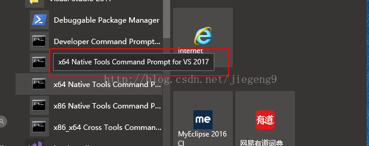
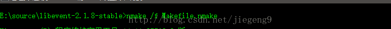
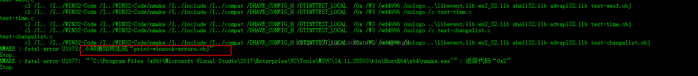
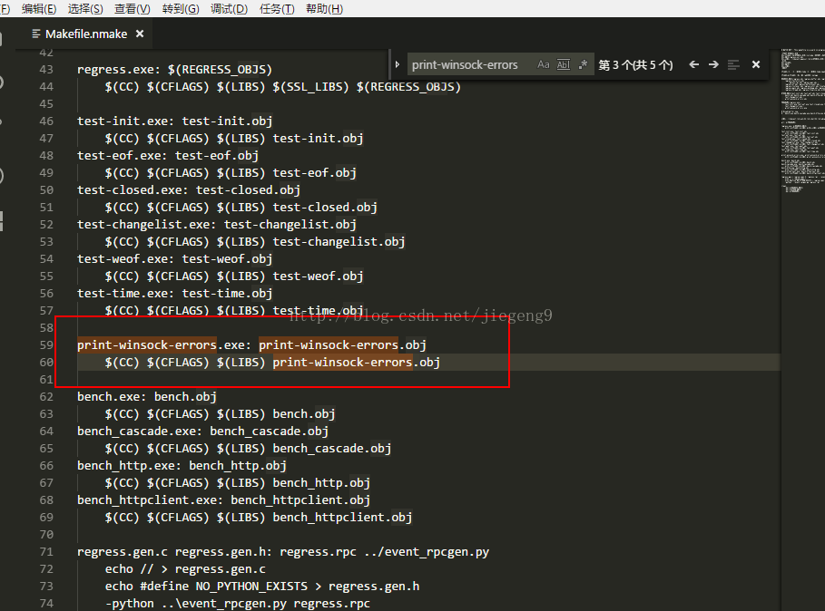
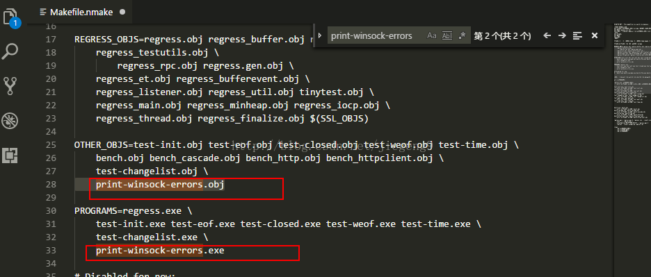
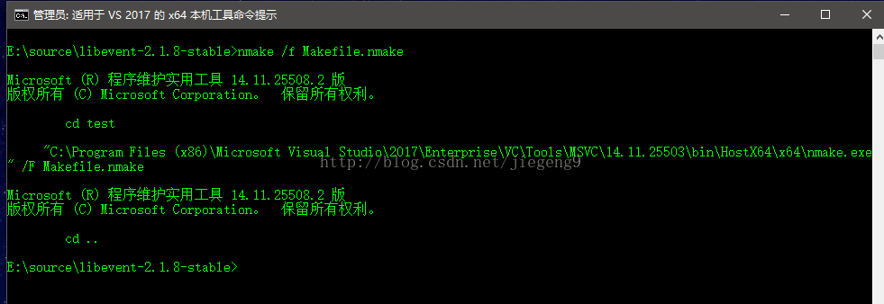
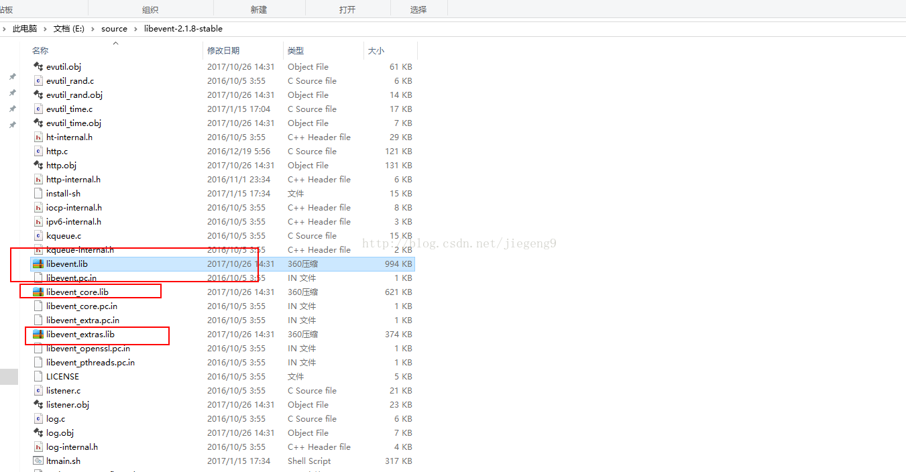

# vs2017编译libevent-2.1.8-stable

libevent

专栏收录该内容

1 篇文章0 订阅

订阅专栏

去官网下载libenvent的源码。http://libevent.org/  这里下载的版本是2.1.8。 然后解压。然后打开你的vs的命令行窗口，按需求打开，如果你要编译64位的，就打开64位

我想编译64bit的，所以我选择如图所示的。用管理员身份打开吧。然后cd到你的源码目录。执行下图命令。

如果你接下来，编译不成功报错，请不要紧张，报错应如图所示。

这里说一下，报错应该是缺少文件的缘故吧！解决方法。修改makefile 。打开libevent解压目录的test/Makefile.nmake    现在要做的就是删除有关print-winsock-errors的东西，

之后再次重新试试

就没有报错了。

最后，你会看到三个lib文件。。

我的邮箱是meilidejiegeng@163.com  如果有什么问题，欢迎联系我。

————————————————

版权声明：本文为CSDN博主「想养个猫咪」的原创文章，遵循CC 4.0 BY-SA版权协议，转载请附上原文出处链接及本声明。

原文链接：https://blog.csdn.net/jiegeng9/article/details/78353725/
