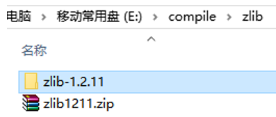
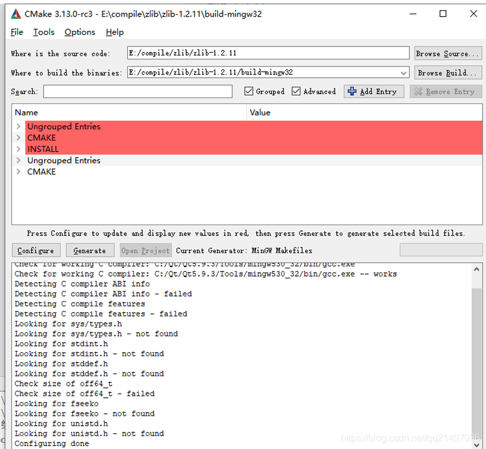
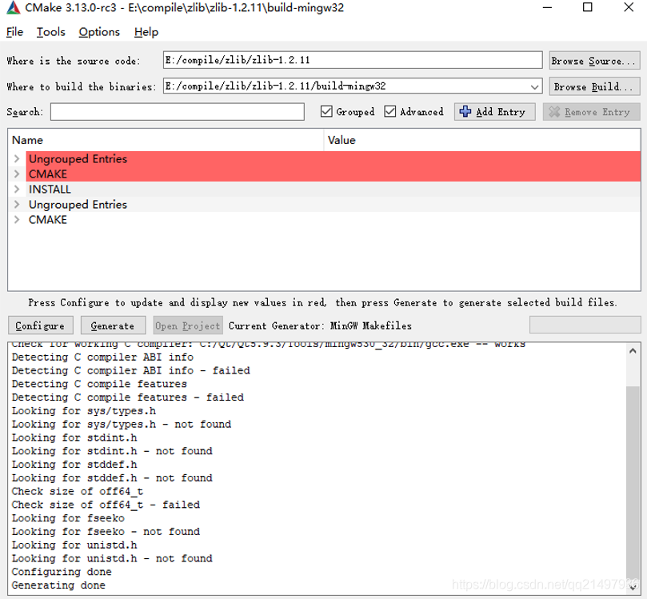
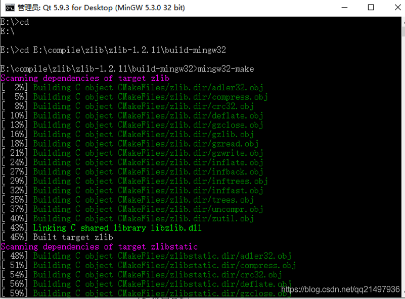
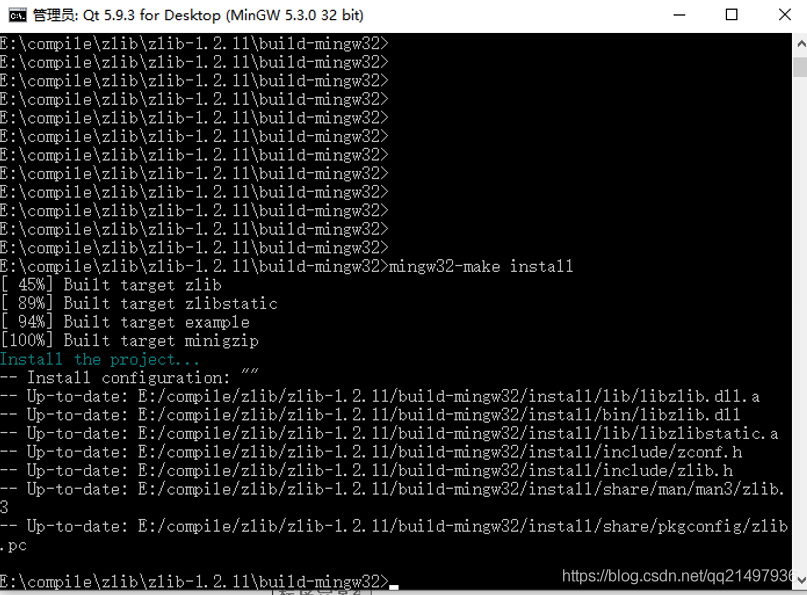
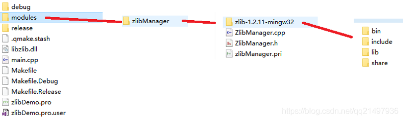
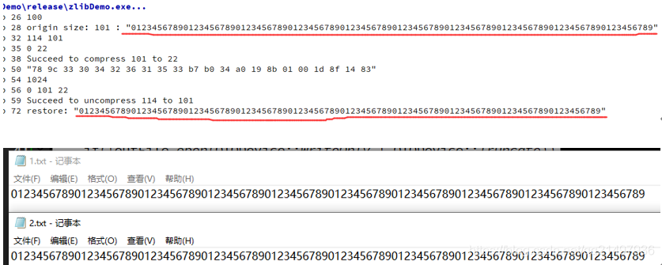

# zlib开发笔记（一）：zlib库介绍、编译和工程模板 #


**前言**

  Qt使用一些压缩解压功能，介绍过libzip库编译，本篇说明zlib库。


**版本编译引导**

- zlib在windows上的mingw32版本编译：[《zlib开发笔记（一）：zlib库介绍、编译和工程模板》](https://blog.csdn.net/qq21497936/article/details/111877005)
- zlib在ubuntu上的编译：[《zlib开发笔记（二）：zlib库介绍、ubuntu平台编译和工程模板》](https://hpzwl.blog.csdn.net/article/details/118713737)
- zlib在ubuntu上的arm交叉编译：[《zlib开发笔记（三）：zlib库介绍、在ubuntu上进行arm平台交叉编译》](https://hpzwl.blog.csdn.net/article/details/119877275)
- zlib在windows上的msvc2015 x64版本编译：[《zlib开发笔记（四）：zlib库介绍、编译windows vs2015x64版本和工程模板》](https://hpzwl.blog.csdn.net/article/details/120981771)

**zlib库**

  zlib被设计为一个免费的，通用的，法律上不受限制的-即不受任何专利保护的无损数据压缩库，几乎可以在任何计算机硬件和操作系统上使用。

  官网：http://www.zlib.net/

  QQ群：1047134658（点击“文件”搜索“zlib”，群内与博文同步更新）


**zlib编译**

步骤一：解压



步骤二：Cmake配置（mingw32版本）



步骤三：生成工程



步骤四：命令行编译



步骤五：安装install



**模块化**



**Demo**

```
void ZlibManager::testEnv()
{
    QString fileName = "1.txt";
    QString outFileName = "1.txt_zip";
    // 打开文件，读取进入内存
    QFile file(fileName);
    if(!file.open(QIODevice::ReadOnly))
    {
        LOG;
        return;
    }
    QByteArray byteArray = file.readAll();
    LOG << byteArray.size();
    byteArray.append((char)0x00);
    LOG << "origin size:" << byteArray.size() << ":" << QString(byteArray);
    file.close();
    // 计算压缩后的文件大小
    int len = compressBound(byteArray.size());
    LOG << len << (uLong)byteArray.size();
    QByteArray compressByteArray = QByteArray(len, 0x00);
    int ret = compress((uchar *)compressByteArray.data(), (uLong *)&len, (uchar *)byteArray.data(), (uLong)byteArray.size());
    LOG << ret << len;
    if(Z_OK == ret)
    {
        LOG << "Succeed to compress" << byteArray.size() << "to" << len;
    }
    //  压缩后存入文件
    QFile outFile(outFileName);
    if(!outFile.open(QIODevice::WriteOnly | QIODevice::Truncate))
    {
        LOG;
        return;
    }
    outFile.write(compressByteArray, len);
    outFile.close();

    LOG << QString(compressByteArray.mid(0, len).toHex(' '));
    // 解压
    QByteArray unCompressByteArray = QByteArray(1024, 0x00);
    // 入坑一 unCompressLen传入的时候，作为指示缓存区的长度，运行完后，作为传出实际的长度
    int unCompressLen = unCompressByteArray.size();
    LOG << unCompressByteArray.size();
    ret = uncompress((uchar *)unCompressByteArray.data(), (uLong *)&unCompressLen, (uchar *)compressByteArray.data(), (uLong)len);
    LOG << ret << unCompressLen << len;
    if(Z_OK == ret)
    {
        LOG << "Succeed to uncompress" << compressByteArray.size() << "to" << unCompressLen;
    }

    // 解压后的存文文件 2.txt
    QString fileName2 = "2.txt";
    QFile file2(fileName2);
    if(!file2.open(QIODevice::WriteOnly | QIODevice::Truncate))
    {
        LOG;
        return;
    }
    file2.write(unCompressByteArray, unCompressLen);
    file2.close();
    LOG << "restore:" << QString(unCompressByteArray.mid(0, unCompressLen));
}
```


运行结果



工程模板v1.0.0

  对应工程模板：zlibDemo_v1.0.0_基础模板_测试压缩解压.rar


上一篇：没有了
下一篇：[《zlib开发笔记（二）：zlib库介绍、ubuntu平台编译和工程模板》](https://hpzwl.blog.csdn.net/article/details/118713737)


若该文为原创文章，转载请注明原文出处

本文章博客地址：https://blog.csdn.net/qq21497936/article/details/111877005

————————————————

版权声明：本文为CSDN博主「长沙红胖子」的原创文章，遵循CC 4.0 BY-SA版权协议，转载请附上原文出处链接及本声明。

原文链接：https://blog.csdn.net/qq21497936/article/details/111877005