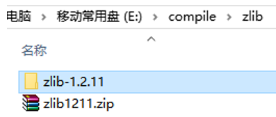
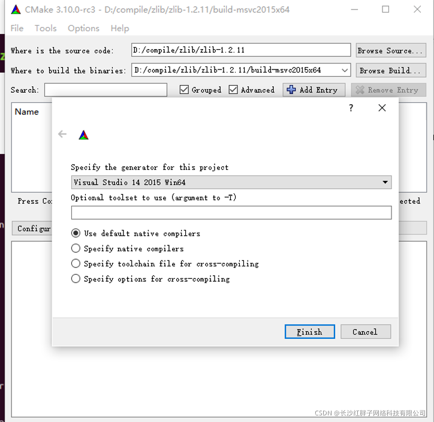
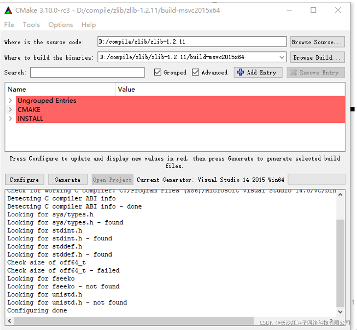
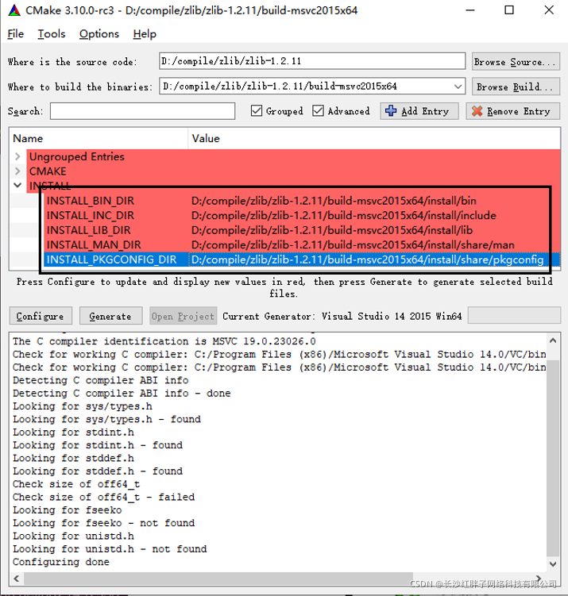
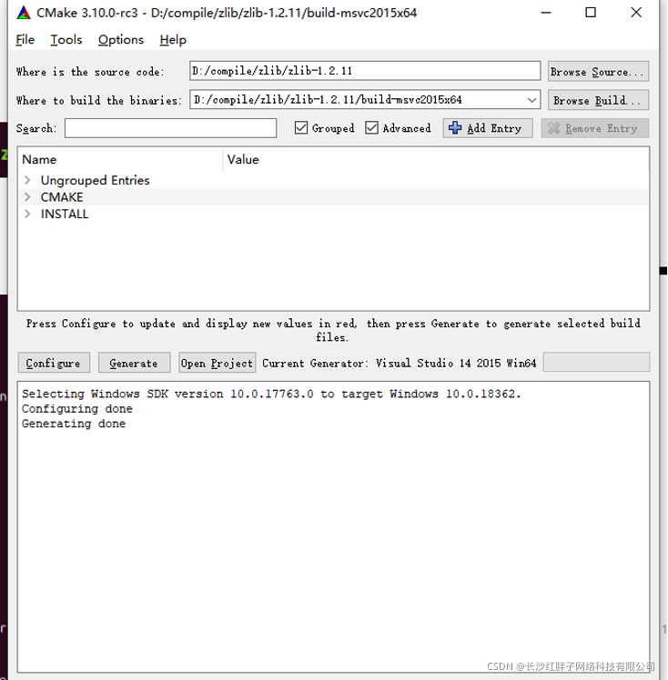
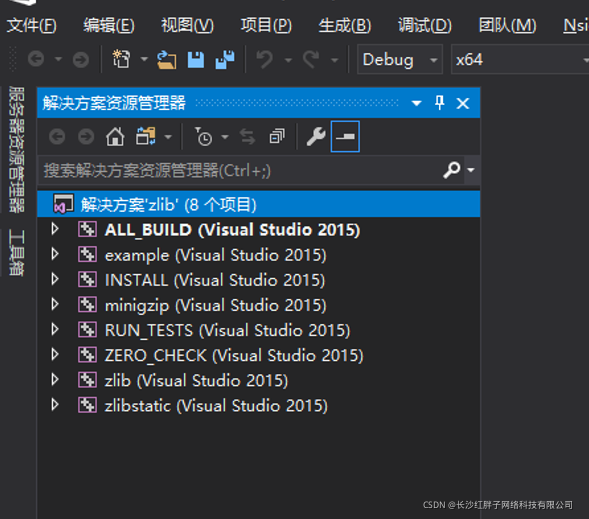
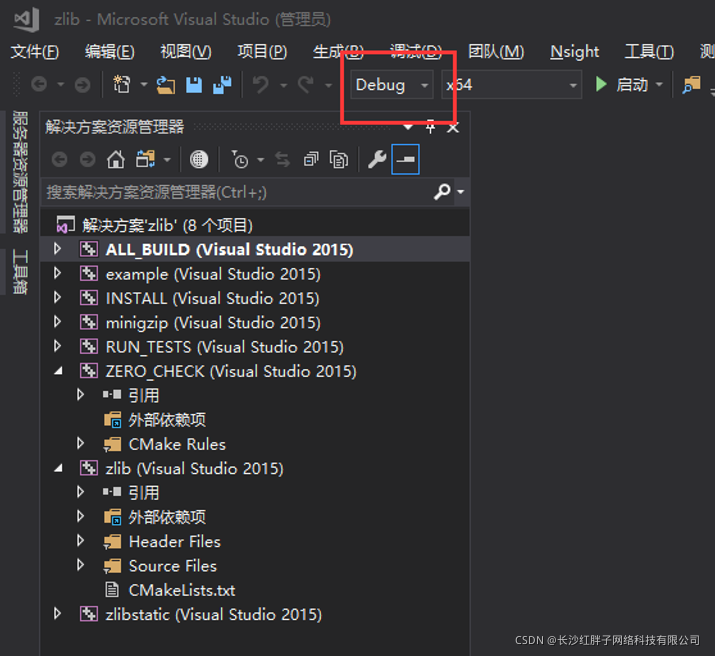
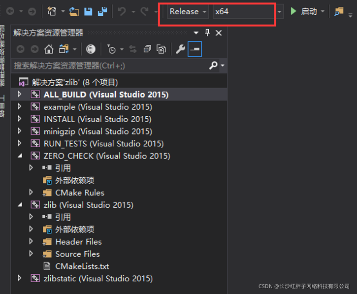

# zlib开发笔记（四）：zlib库介绍、编译windows vs2015x64版本和工程模板 #

[Qt开发专栏：三方库开发技术](https://blog.csdn.net/qq21497936/article/details/102478062#Qt%E5%BC%80%E5%8F%91%E4%B8%93%E6%A0%8F%EF%BC%9A%E8%87%AA%E5%B8%A6%E5%BA%93%E5%92%8C%E4%B8%89%E6%96%B9%E5%BA%93%E7%9A%84%E4%BD%BF%E7%94%A8)

上一篇：[《zlib开发笔记（三）：zlib库介绍、在ubuntu上进行arm平台交叉编译》](https://hpzwl.blog.csdn.net/article/details/119877275)

下一篇：敬请期待…

## 前言 ##

  Qt使用一些压缩解压功能，介绍过libzip库编译，本篇说明zlib库。需要用到zlib的msvc2015x64版本，编译一下。

## 版本编译引导 ##

- zlib在windows上的mingw32版本编译：[《zlib开发笔记（一）：zlib库介绍、编译和工程模板》](https://blog.csdn.net/qq21497936/article/details/111877005)
- zlib在ubuntu上的编译：[《zlib开发笔记（二）：zlib库介绍、ubuntu平台编译和工程模板》](https://hpzwl.blog.csdn.net/article/details/118713737)
- zlib在ubuntu上的arm交叉编译：[《zlib开发笔记（三）：zlib库介绍、在ubuntu上进行arm平台交叉编译》](https://hpzwl.blog.csdn.net/article/details/119877275)
- zlib在windows上的msvc2015 x64版本编译：[《zlib开发笔记（四）：zlib库介绍、编译windows vs2015x64版本和工程模板》](https://hpzwl.blog.csdn.net/article/details/120981771)

## zlib库 ##

  zlib被设计为一个免费的，通用的，法律上不受限制的-即不受任何专利保护的无损数据压缩库，几乎可以在任何计算机硬件和操作系统上使用。

  官网：http://www.zlib.net/

  QQ群：1047134658（点击“文件”搜索“zlib”，群内与博文同步更新）

## zlib编译 ##

**步骤一：解压**

**步骤二：CMake配置（msvc2015 x64版本）**

  配置编译器的版本VS14 2015

  
  开始配置，如下图：
  

  修改安装目标路径，如下图：

  修改后，重新配置一下

**步骤三：生成工程**

  

**步骤四：使用VS2015打开工程**

  (笔者装了VS2017，然后装了VS2015编译器)，所以笔者用VS2017打开，检查编译器为VS2015即可。

步骤五：编译
  分别编译debug和release版本，如下图：
  
  

模块化
  Ubuntu上对于库的模块化不包含库，模块化可参考[《zlib开发笔记（一）：zlib库介绍、编译和工程模板》](https://hpzwl.blog.csdn.net/article/details/111877005)

工程模板v1.0.0
  对应工程模板：zlibDemo_v1.0.0_基础模板_测试压缩解压.rar

上一篇：《zlib开发笔记（三）：zlib库介绍、在ubuntu上进行arm平台交叉编译》
下一篇：敬请期待…

若该文为原创文章，转载请注明原文出处

本文章博客地址：https://hpzwl.blog.csdn.net/article/details/120981771

————————————————

版权声明：本文为CSDN博主「长沙红胖子」的原创文章，遵循CC 4.0 BY-SA版权协议，转载请附上原文出处链接及本声明。

原文链接：https://blog.csdn.net/qq21497936/article/details/120981771